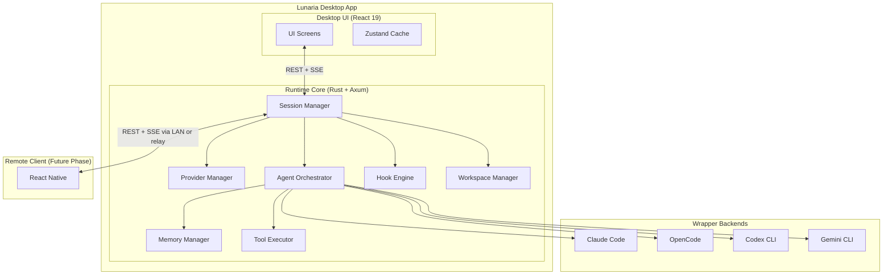

# Lunaria Architecture Documentation

## Overview

**Lunaria** is a desktop-first AI development environment with two product surfaces:

- **Desktop GUI**: Tauri v2 + React 19 + Rust (Axum). This is the primary platform and the execution host.
- **React Native Mobile App**: React Native. This is a paired remote client for the desktop runtime.

There is **no web application** in the active architecture. Older web, WebRTC, and multi-repo material has been removed from the active documentation set.

The desktop runtime supports two execution modes behind one UI:

- **Native mode**: Lunaria runs its own agent loop and calls providers directly.
- **Wrapper mode**: Lunaria wraps Claude Code, OpenCode, Codex CLI, and Gemini CLI.

The Axum server is the single source of truth for application state. Desktop and mobile clients consume the same server-owned contracts.

## Architecture At A Glance

## Active Document Index

### Core Runtime

| Document | Purpose |
|----------|---------|
| [system-architecture.md](system-architecture.md) | Runtime process model, IPC, state ownership, subsystem boundaries, and sequence diagrams. Start here. |
| [agent-backend-interface.md](agent-backend-interface.md) | Native and wrapper backend contracts, provider abstraction, tool interface, permissions, and ecosystem compatibility. |
| [provider-reasoning.md](provider-reasoning.md) | Reasoning-capable model behavior, defaults, overrides, and adaptive policy. |
| [context-attachments.md](context-attachments.md) | Structured file/folder attachment contracts and context ingestion behavior. |
| [multi-agent-runtime.md](multi-agent-runtime.md) | Subagent, team, mailbox, and GUI visibility model. |
| [memory-system.md](memory-system.md) | Claude-mem parity model, observation pipeline, retrieval, injection, and upstream sync policy. |
| [workspace-lifecycle.md](workspace-lifecycle.md) | Workspace creation, review, apply-back, cleanup, and recovery lifecycle. |
| [sandbox-execution.md](sandbox-execution.md) | Per-agent container isolation, Docker/OCI runtime, security model, and fallback modes. |
| [data-model.md](data-model.md) | SQLite schema, JSON config formats, TypeScript interfaces, search indices, and migration strategy. |
| [monorepo-structure.md](monorepo-structure.md) | Current repository layout, workspace organization, and build/tooling expectations for this repo. |
| [implementation-roadmap.md](implementation-roadmap.md) | Phase 0 through V1.5 delivery model and implementation sequencing. |
| [risk-register.md](risk-register.md) | Key delivery, security, runtime, and ecosystem risks with mitigations. |
| [testing-quality-strategy.md](testing-quality-strategy.md) | Verification strategy across runtime, UI, mobile, docs, and contract drift. |

### UI And UX

| Document | Purpose |
|----------|---------|
| [ui-screens.md](ui-screens.md) | Screen inventory, layout behavior, and store ownership across desktop surfaces. |
| [theming-design-system.md](theming-design-system.md) | Tokens, component styling, Monaco/xterm theming, and shared desktop/mobile design rules. |
| [setup-wizard.md](setup-wizard.md) | Canonical 7-step onboarding flow and its persisted state machine. |

### Runtime Extensions

| Document | Purpose |
|----------|---------|
| [api-compatibility.md](api-compatibility.md) | Drop-in OpenAI, Anthropic, and Ollama API compatibility layer — local AI gateway routing through the provider registry. |
| [mcp-protocol.md](mcp-protocol.md) | MCP server and client integration: transports, tool/resource exposure, remote tool aggregation, auth, and phasing. |
| [plugin-framework.md](plugin-framework.md) | Plugin manifest, lifecycle, permissions, extension points, and plugin host rules. |
| [marketplace-discovery.md](marketplace-discovery.md) | Registry aggregation, marketplace indexing, and search/cache design. |
| [tui-capability-matrix.md](tui-capability-matrix.md) | Capability comparison for Claude Code, OpenCode, Codex CLI, Gemini CLI, and Lunaria native mode. |
| [git-github-integration.md](git-github-integration.md) | Git/worktree/GitHub integration patterns used by the desktop runtime. |
| [automation.md](automation.md) | Background automation via time-based schedules and filesystem watchers that trigger autonomous agent sessions. |

### Input And Interaction

| Document | Purpose |
|----------|---------|
| [voice-input.md](voice-input.md) | On-device speech-to-text architecture, Whisper.cpp engine, audio capture pipeline, interaction modes, and platform considerations. V2.0 priority. |

### Security

| Document | Purpose |
|----------|---------|
| [security-model.md](security-model.md) | Threat model, trust boundaries, permission engine, CSP, and secrets management. |
| [agent-identity.md](agent-identity.md) | Cryptographic identity for users, agents, and devices — key hierarchy, access tokens, OS keychain integration, and lifecycle. V2.0 priority. |

### Remote And Notifications

| Document | Purpose |
|----------|---------|
| [remote-control-protocol.md](remote-control-protocol.md) | Paired mobile access, relay model, remote terminal, and device auth. |
| [notification-system.md](notification-system.md) | Desktop-first notifications and future mobile push routing. |

### Documentation

| Document | Purpose |
|----------|---------|
| [documentation-platform.md](documentation-platform.md) | Documentation-site architecture, information architecture, content sources, and reference generation strategy. |

## Reading Order

### For Implementation

1. [system-architecture.md](system-architecture.md)
2. [agent-backend-interface.md](agent-backend-interface.md)
3. [provider-reasoning.md](provider-reasoning.md)
4. [context-attachments.md](context-attachments.md)
5. [multi-agent-runtime.md](multi-agent-runtime.md)
6. [memory-system.md](memory-system.md)
7. [workspace-lifecycle.md](workspace-lifecycle.md)
8. [sandbox-execution.md](sandbox-execution.md)
9. [data-model.md](data-model.md)
10. [ui-screens.md](ui-screens.md)
11. [theming-design-system.md](theming-design-system.md)
12. [setup-wizard.md](setup-wizard.md)
13. [plugin-framework.md](plugin-framework.md)
14. [tui-capability-matrix.md](tui-capability-matrix.md)
15. [implementation-roadmap.md](implementation-roadmap.md)
16. [risk-register.md](risk-register.md)
17. [documentation-platform.md](documentation-platform.md)
18. [testing-quality-strategy.md](testing-quality-strategy.md)

### For Design

1. [theming-design-system.md](theming-design-system.md)
2. [ui-screens.md](ui-screens.md)
3. [setup-wizard.md](setup-wizard.md)
4. [notification-system.md](notification-system.md)

### For Infrastructure And Release

1. [monorepo-structure.md](monorepo-structure.md)
2. [remote-control-protocol.md](remote-control-protocol.md)
3. [implementation-roadmap.md](implementation-roadmap.md)
4. [risk-register.md](risk-register.md)

## Feature Traceability

| Feature | Primary Documents |
|---------|-------------------|
| Native agent loop | [agent-backend-interface.md](agent-backend-interface.md), [system-architecture.md](system-architecture.md), [data-model.md](data-model.md) |
| Wrapper backends | [agent-backend-interface.md](agent-backend-interface.md), [tui-capability-matrix.md](tui-capability-matrix.md), [system-architecture.md](system-architecture.md) |
| API compatibility layer | [api-compatibility.md](api-compatibility.md), [system-architecture.md](system-architecture.md), [agent-backend-interface.md](agent-backend-interface.md) |
| MCP protocol (server + client) | [mcp-protocol.md](mcp-protocol.md), [system-architecture.md](system-architecture.md), [agent-backend-interface.md](agent-backend-interface.md), [plugin-framework.md](plugin-framework.md) |
| Session lifecycle and persistence | [system-architecture.md](system-architecture.md), [data-model.md](data-model.md) |
| Memory system | [memory-system.md](memory-system.md), [data-model.md](data-model.md), [system-architecture.md](system-architecture.md) |
| Hooks and plugins | [plugin-framework.md](plugin-framework.md), [system-architecture.md](system-architecture.md), [data-model.md](data-model.md) |
| Sandbox execution and agent isolation | [sandbox-execution.md](sandbox-execution.md), [workspace-lifecycle.md](workspace-lifecycle.md), [system-architecture.md](system-architecture.md) |
| Setup and provider onboarding | [setup-wizard.md](setup-wizard.md), [agent-backend-interface.md](agent-backend-interface.md), [tui-capability-matrix.md](tui-capability-matrix.md) |
| Desktop UI and design system | [ui-screens.md](ui-screens.md), [theming-design-system.md](theming-design-system.md) |
| Mobile pairing and remote access | [remote-control-protocol.md](remote-control-protocol.md), [notification-system.md](notification-system.md), [data-model.md](data-model.md) |
| Voice input and transcription | [voice-input.md](voice-input.md), [system-architecture.md](system-architecture.md), [ui-screens.md](ui-screens.md) |
| Documentation site and developer docs | [documentation-platform.md](documentation-platform.md), [plugin-framework.md](plugin-framework.md), [data-model.md](data-model.md) |
| Reference documentation | [documentation-platform.md](documentation-platform.md), [data-model.md](data-model.md), [agent-backend-interface.md](agent-backend-interface.md), [remote-control-protocol.md](remote-control-protocol.md) |
| Background automation (schedules and watchers) | [automation.md](automation.md), [system-architecture.md](system-architecture.md), [plugin-framework.md](plugin-framework.md), [data-model.md](data-model.md) |
| Cryptographic agent identity | [agent-identity.md](agent-identity.md), [security-model.md](security-model.md), [remote-control-protocol.md](remote-control-protocol.md), [data-model.md](data-model.md) |

## Consistency Notes

- **Primary source of truth**: user scope and active architecture docs in this directory.
- **Desktop first**: the desktop runtime owns state, execution, permissions, storage, and notifications.
- **Mobile second**: the React Native app is a remote client, not a second execution host.
- **No web app**: any historical references to web clients, TanStack Start, WebRTC, or browser push are stale unless explicitly called out as removed history.
- **Backend naming**: use `native | claude-code | opencode | codex | gemini` for runtime/backend kinds.
- **Session terminology**: use `session`, not `conversation`, except when describing external tool internals.

## Quick Links

| Resource | Value |
|----------|-------|
| Desktop stack | Tauri v2 + React 19 + Rust (Axum) |
| Mobile stack | React Native (packages/ui-native, NativeWind) |
| Runtime transport | REST + SSE |
| Build system | bun workspaces |
| Package scope | `@lunaria/*` |

*Last updated: 2026-03-10*
