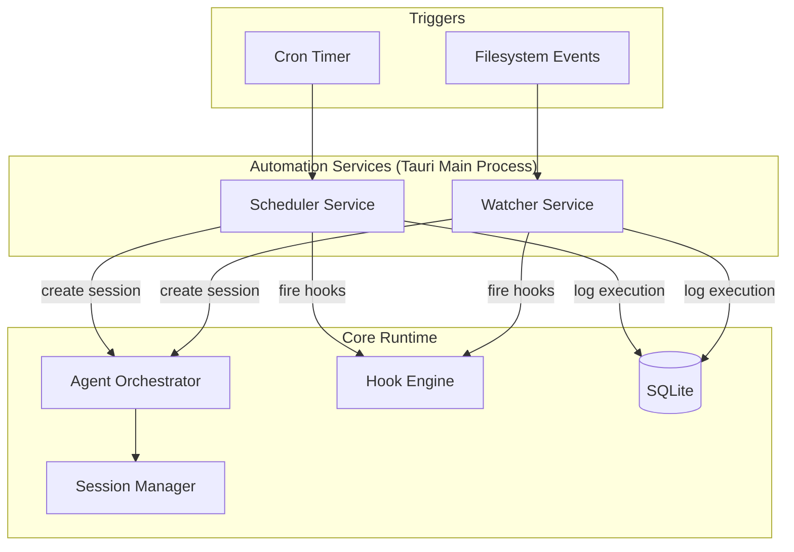
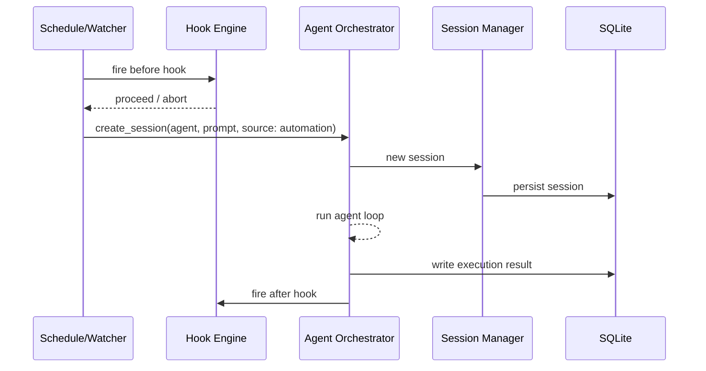

# Automation: Schedules & Watchers

## Scope

This document defines background automation triggers for agent tasks in Amoena. Two mechanisms exist: **time-based schedules** (cron-like recurring execution) and **event-based watchers** (filesystem monitoring). Both integrate with the Agent Orchestrator to spawn autonomous agent sessions without user intervention.

**Priority**: V2.0

## Overview

Automation enables Amoena to perform agent-driven work in the background. Instead of waiting for a user prompt, the system triggers agent sessions based on recurring time intervals or filesystem events. Each automation rule defines a target agent, an objective prompt, and execution constraints. The Tauri main process owns all automation state and scheduling logic.



## Schedules

### Concept

Schedules execute agent tasks on a recurring basis using cron expressions. Each schedule maps a time pattern to an agent session with a fixed objective. The scheduler service runs in the Tauri main process and evaluates cron expressions against the system clock.

### Schedule Definition

| Field | Type | Required | Description |
|-------|------|----------|-------------|
| `id` | `string` | yes | Unique identifier (kebab-case) |
| `name` | `string` | yes | Human-readable display name |
| `cron` | `string` | yes | Standard cron expression (5 fields: minute, hour, day-of-month, month, day-of-week) |
| `agent` | `string` | yes | Agent profile ID to run the task |
| `prompt` | `string` | yes | Objective prompt sent to the agent session |
| `enabled` | `boolean` | yes | Whether the schedule is active |
| `timeout_minutes` | `number` | no | Maximum execution time before the session is terminated (default: 30) |

### Schedule Configuration

```json
{
  "id": "daily-summary",
  "name": "Daily Code Summary",
  "cron": "0 9 * * 1-5",
  "agent": "default",
  "prompt": "Summarize yesterday's git commits and open issues",
  "enabled": true,
  "timeout_minutes": 10
}
```

### Examples

| Schedule | Cron | Objective |
|----------|------|-----------|
| Daily code summary | `0 9 * * 1-5` | Summarize yesterday's git commits and open issues |
| PR review sweep | `0 */2 * * *` | Review all open PRs and flag any that need attention |
| Weekly workspace backup | `0 3 * * 0` | Archive current workspace state and push to remote |

### Scheduler Service

The scheduler service is a Rust module in the Tauri main process. It:

1. Loads schedule definitions from SQLite on startup.
2. Evaluates all enabled schedules against the current time on a once-per-minute tick.
3. When a schedule fires, creates an agent session via the Agent Orchestrator with the configured prompt.
4. Tracks execution state (running, completed, failed, timed-out) in SQLite.
5. Enforces per-schedule timeout by cancelling the session if the limit is exceeded.

Schedule definitions and execution history are persisted in SQLite. See [data-model.md](data-model.md) for schema details.

## Watchers

### Concept

Watchers monitor the filesystem for changes and trigger agent sessions when matching events occur. Each watcher defines a set of glob patterns, event types, and an agent objective. Watchers use OS-native file watching for efficiency.

### Watcher Definition

| Field | Type | Required | Description |
|-------|------|----------|-------------|
| `id` | `string` | yes | Unique identifier (kebab-case) |
| `name` | `string` | yes | Human-readable display name |
| `paths` | `string[]` | yes | Glob patterns for paths to monitor (relative to workspace root) |
| `events` | `string[]` | yes | Event types to react to: `created`, `modified`, `deleted`, `renamed` |
| `agent` | `string` | yes | Agent profile ID to run the task |
| `prompt` | `string` | yes | Objective prompt template; may include `{{path}}` and `{{event}}` placeholders |
| `debounce_ms` | `number` | no | Debounce interval in milliseconds (default: 5000) |
| `enabled` | `boolean` | yes | Whether the watcher is active |

### Watcher Configuration

```json
{
  "id": "docs-toc",
  "name": "Auto-generate docs TOC",
  "paths": ["docs/**/*.md"],
  "events": ["created", "modified", "deleted"],
  "agent": "default",
  "prompt": "Update the docs/README.md table of contents based on current doc files",
  "debounce_ms": 5000,
  "enabled": true
}
```

### Examples

| Watcher | Paths | Events | Objective |
|---------|-------|--------|-----------|
| Docs TOC | `docs/**/*.md` | created, modified, deleted | Update the docs README table of contents |
| Test failure analysis | `src/**/*.test.{ts,rs}` | modified | Analyze failing tests and suggest fixes |
| New component scaffold | `src/components/*.tsx` | created | Generate unit test and storybook entry for the new component |

### Watcher Service

The watcher service is a Rust module in the Tauri main process using the [`notify`](https://crates.io/crates/notify) crate for cross-platform filesystem event monitoring.

| Platform | Backend |
|----------|---------|
| macOS | FSEvents |
| Linux | inotify |
| Windows | ReadDirectoryChangesW |

The watcher service:

1. Loads watcher definitions from SQLite on startup.
2. Registers OS-native watches for all enabled watchers' glob patterns.
3. Applies debounce to coalesce rapid filesystem events within the configured window.
4. When a debounced event batch fires, creates an agent session via the Agent Orchestrator with the prompt template expanded (substituting `{{path}}` and `{{event}}` placeholders).
5. Logs watcher trigger events and execution results to SQLite.

## Architecture

### Service Lifecycle

Both the scheduler and watcher services are initialized during Tauri main process startup and shut down gracefully on application exit. They are managed as Rust modules alongside the existing core managers (Session Manager, Agent Orchestrator, Hook Engine).

### Agent Session Creation

When a schedule or watcher fires:

1. The automation service calls the Agent Orchestrator's session creation API.
2. A new session is created with `source: "automation"` metadata, linking back to the schedule or watcher ID.
3. The agent runs autonomously with the configured prompt as the initial user message.
4. On completion (or timeout/failure), the execution result is recorded in SQLite.



### Execution History

All automation executions are recorded in SQLite for auditability and UI display.

| Field | Type | Description |
|-------|------|-------------|
| `id` | `string` | Execution ID |
| `automation_id` | `string` | Schedule or watcher ID |
| `automation_type` | `string` | `schedule` or `watcher` |
| `session_id` | `string` | Agent session ID |
| `started_at` | `datetime` | Execution start time |
| `finished_at` | `datetime` | Execution end time |
| `duration_ms` | `number` | Total execution duration |
| `status` | `string` | `completed`, `failed`, `timed_out`, `cancelled` |
| `output_summary` | `string` | Agent-generated summary of what was done |

### Axum REST Surface (Remote Access)

When remote access is enabled, the Axum server exposes automation management endpoints that proxy to the Tauri main process.

| Endpoint | Method | Purpose |
|----------|--------|---------|
| `/automation/schedules` | `GET` | List all schedules |
| `/automation/schedules` | `POST` | Create a schedule |
| `/automation/schedules/:id` | `PUT` | Update a schedule |
| `/automation/schedules/:id` | `DELETE` | Delete a schedule |
| `/automation/watchers` | `GET` | List all watchers |
| `/automation/watchers` | `POST` | Create a watcher |
| `/automation/watchers/:id` | `PUT` | Update a watcher |
| `/automation/watchers/:id` | `DELETE` | Delete a watcher |
| `/automation/history` | `GET` | Query execution history |
| `/automation/pause` | `POST` | Pause or resume all automations |

### UI Surface

The desktop UI includes an **Automation** panel accessible from settings. The panel provides:

- **Schedules tab**: List, create, edit, enable/disable, and delete schedules. Shows next run time and last execution status.
- **Watchers tab**: List, create, edit, enable/disable, and delete watchers. Shows monitored paths and trigger counts.
- **History tab**: Chronological execution log with status, duration, and output summaries. Links to the agent session for full conversation review.
- **Global toggle**: Pause/resume all automations with a single switch.

## Hook Engine Integration

Automation triggers fire through the existing [Hook Engine](plugin-framework.md). Plugins can listen to automation lifecycle events.

| Hook | Payload | Timing |
|------|---------|--------|
| `schedule:before` | Schedule definition, planned prompt | Before session creation; handler can modify prompt or abort |
| `schedule:after` | Schedule definition, execution result | After session completes or times out |
| `watcher:triggered` | Watcher definition, matched paths, event types | After debounce, before session creation; handler can modify prompt or abort |

Hooks follow the same async handler contract defined in [plugin-framework.md](plugin-framework.md). A handler returning `{ abort: true }` from a `before` hook prevents the automation session from starting.

## Limits & Safety

| Control | Default | Configurable |
|---------|---------|-------------|
| Max concurrent automation sessions | 3 | Yes (global setting) |
| Per-schedule timeout | 30 minutes | Yes (per schedule) |
| Watcher debounce | 5000 ms | Yes (per watcher) |
| Global automation pause | Off | Yes (single toggle) |

### Safety Guarantees

- **Concurrency cap**: The automation service enforces a maximum number of concurrent automation-triggered sessions. If the cap is reached, new triggers are queued and executed when a slot opens.
- **Timeout enforcement**: Each schedule has a configurable timeout. The scheduler cancels the agent session if the timeout is exceeded.
- **Debounce**: Watcher debounce coalesces rapid filesystem events (e.g., batch file saves, `git checkout`) into a single trigger, preventing automation storms.
- **User notifications**: Desktop notifications are sent on automation completion or failure. Notification preferences follow the rules in [notification-system.md](notification-system.md).
- **Global kill switch**: A single toggle in settings pauses all schedules and watchers immediately. Pausing does not delete definitions; re-enabling resumes normal operation.
- **Audit trail**: All executions are logged to SQLite with status, duration, and output summary for post-hoc review.

## Dependencies

| Component | Dependency | Purpose |
|-----------|-----------|---------|
| Scheduler service | Agent Orchestrator | Session creation and agent execution |
| Scheduler service | Hook Engine | Lifecycle hooks for plugins |
| Scheduler service | SQLite | Schedule definitions and execution history |
| Watcher service | `notify` crate | Cross-platform filesystem event monitoring |
| Watcher service | Agent Orchestrator | Session creation and agent execution |
| Watcher service | Hook Engine | Lifecycle hooks for plugins |
| Watcher service | SQLite | Watcher definitions and execution history |
| UI panel | Tauri `invoke` | CRUD operations on schedules and watchers |
| Remote API | Axum server | Proxy automation management to Tauri main process |

*Last updated: 2025-07-18*
