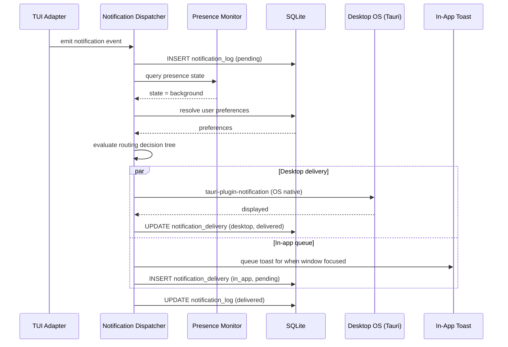

# Notification System Design

## Overview

Amoena's MVP notification system delivers notifications via the OS native notification center using Tauri's notification API. The desktop app is the sole execution host, so all notification routing happens locally — no cloud services, push credentials, or external accounts are required.

For MVP, notifications route based on a simple two-state presence model: **app focused** (user is actively interacting with the Amoena window) vs **app in background** (window is not focused or minimized). Focused state prefers in-app toasts, while background state delivers OS-native notifications and queues matching in-app toasts for when the user returns.

The Notification Dispatcher is a Rust-side component in the Tauri main process. It classifies incoming events, evaluates presence state, applies urgency and preference rules, and dispatches notifications via `tauri-plugin-notification`. All dispatch decisions are logged to the `notification_log` SQLite table for audit and delivery tracking.

> **Mobile push notifications (FCM / APNs) are post-MVP.** Delivering push to paired phones and tablets requires a cloud relay service because an open-source desktop app cannot ship Firebase service account credentials or Apple Developer certificates. Push is therefore reserved for a self-hosted or paid relay service.

### Design Principles

- **Desktop-first**: MVP notifications use only Tauri's OS notification API — no third-party push services required.
- **Urgency-aware**: Urgency level influences visual presentation, sound, and auto-dismiss behavior.
- **User control**: Per-TUI and per-type notification preferences override defaults.
- **At-least-once delivery**: Every notification is persisted before dispatch; failures trigger retries.
- **Platform-native experience**: macOS, Windows, and Linux each receive native OS notifications.

## Presence Detection (MVP)

### Two-State Presence Model

For MVP, presence is a simple boolean derived from Tauri window focus events:

| State | Meaning | Detection |
| --- | --- | --- |
| `focused` | User is interacting with the Amoena window | `window.on_focus_changed` → focused |
| `background` | Amoena window is not focused or is minimized | `window.on_focus_changed` → blurred / minimized |

**Implementation approach:**

1. A shared `AtomicBool` (`window_focused`) is updated by Tauri window focus/blur callbacks.
2. The Notification Dispatcher reads this flag synchronously when routing each notification.
3. State changes emit a `presence:changed` Tauri event so the webview UI can update status indicators.

**Privacy guarantee:** No keystrokes, mouse coordinates, or application names are recorded. Only window focus state is tracked.

```rust
#[derive(Clone, Serialize, PartialEq)]
pub enum PresenceState {
    Focused,
    Background,
}

#[derive(Clone, Serialize)]
pub struct PresenceChangeEvent {
    pub previous: PresenceState,
    pub current: PresenceState,
    pub since: ISODateString,
}
```

> **Post-MVP**: A richer 4-state model (Active → Idle → Away → Extended Away) based on OS-level input monitoring is documented in the [Future: AFK Detection](#future-afk-detection-and-remote-push) section. This is a prerequisite for AFK-triggered push delivery.

## Notification Routing (MVP)

### Routing Decision Tree

Every notification passes through the Notification Dispatcher. For MVP, routing targets the desktop OS notification center and the in-app toast layer only.

```
Notification Event Received
│
├─ Is notification muted for this type/TUI?
│  └─ YES → Log as suppressed → END
│
├─ Evaluate urgency level
│  └─ CRITICAL → OS notification + in-app toast (regardless of focus state) → END
│
├─ Check presence state
│  ├─ FOCUSED
│  │  └─ In-app toast only (OS notification optional, respects desktopEnabled setting)
│  │
│  └─ BACKGROUND
│     └─ OS native notification + queue for in-app toast on return
│
└─ Log dispatch decision to notification_log
```

### Urgency Levels

| Urgency | Routing Override | Sound | Badge | Auto-dismiss | Examples |
| --- | --- | --- | --- | --- | --- |
| `low` | Follows presence rules | None | Counter only | 30s | Usage milestone, sync complete |
| `normal` | Follows presence rules | Default tone | Counter + toast | 10s | Session completed, task done |
| `high` | Follows presence rules, always includes sound | Alert tone | Persistent toast | Manual dismiss | Permission request, error |
| `critical` | Delivers regardless of focus state | Alarm tone | Persistent + banner | Manual dismiss | Session crash, auth failure, data loss risk |

**Urgency assignment rules:**

| Notification Type | Default Urgency | Overridable |
| --- | --- | --- |
| `permission_request` | `high` | No (security-sensitive) |
| `task_complete` | `normal` | Yes |
| `error` | `high` | Yes (can lower to `normal`) |
| `session_event` | `low` | Yes |
| `system_alert` | `critical` | No |
| `subagent_completion` | `normal` | Yes |
| `team_task_done` | `normal` | Yes |
| `observation_created` | `low` | Yes |
| `compaction_triggered` | `low` | Yes |
| `provider_auth_expiry` | `high` | No (security-sensitive) |
| `autopilot_story_complete` | `normal` | Yes |
| `opinion_ready` | `normal` | Yes |
| `workspace_clone_complete` | `normal` | Yes |
| `workspace_clone_failed` | `high` | Yes (can lower to `normal`) |
| `remote_session_connected` | `low` | Yes |
| `remote_session_disconnected` | `low` | Yes |

### User Preferences

Users configure notification behavior at three levels, resolved with cascading precedence:

```
Per-Session Override  >  Per-TUI Config  >  Global Config
```

**Global notification settings** (`~/.amoena/config.json`):

```json
{
  "notifications": {
    "desktopEnabled": true,
    "soundEnabled": true
  }
}
```

**Per-TUI notification overrides** (stored in `settings` table):

| Key | Type | Description |
| --- | --- | --- |
| `notifications.enabled` | boolean | Master toggle for this TUI's notifications |
| `notifications.mutedTypes` | string[] | Notification types to suppress (e.g., `["session_event"]`) |
| `notifications.urgencyOverrides` | object | Map of `{type: urgency}` overrides |
| `notifications.soundEnabled` | boolean | Override sound for this TUI |

**Per-session overrides** (stored in `settings` table with `scope = 'per-session'`):

| Key | Type | Description |
| --- | --- | --- |
| `notifications.muted` | boolean | Mute all notifications for this session |
| `notifications.mutedTypes` | string[] | Suppress specific types for this session |

**Preference resolution example:**

1. Session `ses_abc` has `notifications.muted = false` and `notifications.mutedTypes = ["session_event"]`.
2. TUI `claude-code` has `notifications.enabled = true` and `notifications.mutedTypes = []`.
3. Global has `desktopEnabled = true`.
4. Result: Session events from `ses_abc` are suppressed; all other notification types from `claude-code` are delivered.

## Desktop Notifications (OS Native)

Desktop notifications use Tauri's built-in notification plugin (`tauri-plugin-notification`) for cross-platform OS-native alerts.

**Platform support:**

| Platform | API | Features |
| --- | --- | --- |
| macOS | `UNUserNotificationCenter` | Banners, alerts, sounds, actions, badges |
| Windows | Windows Toast Notifications (WinRT) | Toast, action center, sounds |
| Linux | `libnotify` / D-Bus `org.freedesktop.Notifications` | Popups, actions, urgency hints |

**Desktop notification flow:**

1. Notification Dispatcher creates a `DesktopNotification` payload.
2. Calls `tauri-plugin-notification` API with title, body, icon, sound, and action buttons.
3. OS displays native notification.
4. User interaction (click, action button, dismiss) is captured via Tauri event callback.
5. Interaction is logged and, if applicable, triggers a command (e.g., approve permission, open session).

**In-app toast notifications:**

In addition to OS-native notifications, the webview displays in-app toasts via the notification Zustand store (`useNotificationStore` in the UI docs). This provides:

- Notification history panel (scrollable, filterable).
- Unread badge counter in the sidebar.
- Quick actions directly in the toast (approve/deny, open session, dismiss).
- Toast stacking with auto-dismiss based on urgency level.

## Notification Types

### Permission Requests

**Source:** TUI adapters emit `permission:requested` events when a CLI tool requests filesystem, network, or shell access.

| Field | Value |
| --- | --- |
| Type | `permission_request` |
| Default urgency | `high` |
| Routing | Desktop only (MVP) |
| Actions | Approve, Deny, View Details |
| Auto-dismiss | Never (requires explicit user action) |

**Background behavior (MVP):** When the user is away from the window, the OS notification carries the permission request. The user must return to the Amoena window to approve or deny it. If no response within a configurable timeout (default: 5 minutes), the permission is auto-denied for safety.

> **Post-MVP**: Push-based permission approval from paired mobile devices requires the cloud relay push architecture.

### Session Events

**Source:** Session Manager emits lifecycle events (created, completed, failed, archived).

| Field | Value |
| --- | --- |
| Type | `session_event` or `task_complete` |
| Default urgency | `low` (lifecycle) / `normal` (completion) |
| Routing | Desktop only (MVP) |
| Actions | Open Session, Dismiss |
| Auto-dismiss | 30s (low) / 10s (normal) |

**Completion notifications include:**

- Session duration.
- Token usage summary.
- Cost estimate.
- Final status (success, partial, failed).

### Errors

**Source:** TUI adapters, Session Manager, or system components emit error events.

| Field | Value |
| --- | --- |
| Type | `error` |
| Default urgency | `high` |
| Routing | Desktop only (MVP) |
| Actions | View Error, Retry, Open Session |
| Auto-dismiss | Never |

**Error categories:**

- **Adapter errors**: CLI crash, connection timeout, protocol mismatch.
- **Auth errors**: Token expired, API key invalid, provider rejected.
- **Runtime errors**: Out of memory, disk full, process spawn failure.
- **Rate limit errors**: Provider throttling, quota exceeded.

### Subagent Completion

**Source:** Agent runtime emits `SubagentStop` lifecycle event when a subagent finishes execution.

| Field | Value |
| --- | --- |
| Type | `subagent_completion` |
| Default urgency | `normal` |
| Routing | Desktop only (MVP) |
| Actions | View Result, Open Parent Session, Dismiss |
| Auto-dismiss | 10s |

**Payload includes:** subagent type, parent session ID, exit status (success/failure), duration, and token usage.

### Team Task Done

**Source:** Coordination layer emits `TaskCompleted` when a delegated team task finishes.

| Field | Value |
| --- | --- |
| Type | `team_task_done` |
| Default urgency | `normal` |
| Routing | Desktop only (MVP) |
| Actions | View Task Output, Open Session, Dismiss |
| Auto-dismiss | 10s |

### Observation Created

**Source:** Memory system emits an event when a new observation is persisted to the database.

| Field | Value |
| --- | --- |
| Type | `observation_created` |
| Default urgency | `low` |
| Routing | Desktop only (MVP) |
| Actions | View Observation, Open Session, Dismiss |
| Auto-dismiss | 30s |

**Note:** High-volume observation creation (e.g., during active agent runs) is batched — a single summary notification is emitted per 10-second window rather than one per observation.

### Compaction Triggered

**Source:** Session Manager triggers context compaction when the context window approaches its limit.

| Field | Value |
| --- | --- |
| Type | `compaction_triggered` |
| Default urgency | `low` |
| Routing | Desktop only (MVP) |
| Actions | View Session, Dismiss |
| Auto-dismiss | 30s |

**Payload includes:** session ID, tokens before/after compaction, and compaction strategy used.

### Permission Request (Urgent)

**Source:** Agent runtime requests user permission for a sensitive operation. This is the urgent variant that requires immediate user response.

| Field | Value |
| --- | --- |
| Type | `permission_request` |
| Default urgency | `high` |
| Routing | Desktop (OS notification, regardless of focus) |
| Actions | Approve, Deny, View Details |
| Auto-dismiss | Never (requires explicit user action) |

**Behavior:** This notification is always delivered with sound and persists until the user acts. If no response within configurable timeout (default: 5 minutes), the permission is auto-denied for safety. See also the [Permission Requests](#permission-requests) section above for the full flow.

### Provider Auth Expiry

**Source:** Credential store detects that a provider API key or OAuth token is expired or about to expire.

| Field | Value |
| --- | --- |
| Type | `provider_auth_expiry` |
| Default urgency | `high` |
| Routing | Desktop only (MVP) |
| Actions | Re-authenticate, View Settings, Dismiss |
| Auto-dismiss | Never |

**Payload includes:** provider name, expiry timestamp, and affected sessions (if any are actively using the expiring credential).

### Autopilot Story Complete

**Source:** Autopilot workflow emits completion when a full story/feature implementation cycle finishes.

| Field | Value |
| --- | --- |
| Type | `autopilot_story_complete` |
| Default urgency | `normal` |
| Routing | Desktop only (MVP) |
| Actions | View Results, Open Session, Run Tests, Dismiss |
| Auto-dismiss | Never (important outcome) |

**Payload includes:** story summary, files changed count, test results, and total cost.

### Opinion Ready

**Source:** Agent emits an event when it has formed an opinion or recommendation that requires user review.

| Field | Value |
| --- | --- |
| Type | `opinion_ready` |
| Default urgency | `normal` |
| Routing | Desktop only (MVP) |
| Actions | View Opinion, Open Session, Dismiss |
| Auto-dismiss | 10s |

### Workspace Clone Complete/Failed

**Source:** Workspace manager emits events when a CoW clone or git worktree operation completes or fails.

| Field | Value |
| --- | --- |
| Type | `workspace_clone_complete` or `workspace_clone_failed` |
| Default urgency | `normal` (complete) / `high` (failed) |
| Routing | Desktop only (MVP) |
| Actions | Open Workspace, View Error (on failure), Dismiss |
| Auto-dismiss | 10s (complete) / Never (failed) |

### Remote Session Connected/Disconnected

**Source:** Remote control server emits events when a remote client connects or disconnects.

| Field | Value |
| --- | --- |
| Type | `remote_session_connected` or `remote_session_disconnected` |
| Default urgency | `low` |
| Routing | Desktop only (MVP) |
| Actions | View Device, Manage Devices, Dismiss |
| Auto-dismiss | 10s |

**Payload includes:** device name, device type (mobile/tablet), and connection method (LAN/relay).

### External Integration Triggers

**Source:** External integration plugins (Gmail, Linear, Slack, etc.) emit events via the plugin notification API.

| Field | Value |
| --- | --- |
| Type | `session_event` (bridged) or `system_alert` (critical) |
| Default urgency | Varies by integration priority mapping |
| Routing | Desktop only (MVP) |
| Actions | Open Integration Panel, View Source, Dismiss |
| Auto-dismiss | Based on urgency |

**Integration notification bridging:**

1. External plugin receives a webhook or poll result.
2. Plugin calls `host.notify({ type, severity, title, body, metadata })`.
3. Notification Dispatcher classifies and routes using the same MVP pipeline.
4. Integration-specific deep links open the relevant sidebar panel.

### System Alerts

**Source:** Core system components (disk space, update available, migration required).

| Field | Value |
| --- | --- |
| Type | `system_alert` |
| Default urgency | `critical` |
| Routing | Desktop (OS notification, regardless of focus) |
| Actions | Context-dependent |
| Auto-dismiss | Never |

## Delivery Guarantees

### At-Least-Once Delivery

Every notification follows a **persist-then-dispatch** pattern to guarantee at-least-once delivery:

```
1. Event received by Notification Dispatcher
2. INSERT into notification_log (status: 'pending')
3. Evaluate routing rules → determine target channels
4. UPDATE notification_log.dispatched_to with target list
5. Attempt delivery to each target channel
6. On success: UPDATE status to 'delivered' per channel
7. On failure: UPDATE status to 'retry_pending' per channel
8. Retry loop picks up 'retry_pending' entries
```

**Delivery states per channel:**

| State | Meaning |
| --- | --- |
| `pending` | Persisted, not yet dispatched |
| `dispatched` | Sent to delivery channel (OS API) |
| `delivered` | Confirmed delivered (OS displayed) |
| `failed` | Delivery failed after all retries exhausted |
| `suppressed` | Filtered by user preferences or mute rules |
| `expired` | TTL exceeded before delivery |

### Deduplication

Duplicate notifications are prevented at multiple levels:

1. **Event-level dedup**: Each notification event carries a deterministic `idempotency_key` derived from `{source_tui}:{session_id}:{type}:{content_hash}:{timestamp_bucket}`. The timestamp bucket is a 10-second window to collapse rapid-fire duplicates.

2. **Database-level dedup**: Before inserting into `notification_log`, the Dispatcher checks for an existing entry with the same idempotency key within a configurable dedup window (default: 60 seconds).

### Retry Logic

Failed deliveries are retried with exponential backoff and jitter:

| Attempt | Delay | Max Delay |
| --- | --- | --- |
| 1st retry | 2s + jitter (0–1s) | 3s |
| 2nd retry | 4s + jitter (0–2s) | 6s |
| 3rd retry | 8s + jitter (0–4s) | 12s |
| 4th retry | 16s + jitter (0–8s) | 24s |
| 5th retry | 32s + jitter (0–16s) | 48s |

**Retry policy:**

- Maximum retries: 5 per channel.
- Total retry window: ~90 seconds.
- After max retries: mark as `failed`, log error, emit `notification:delivery_failed` event.
- Network errors: retry immediately once, then enter backoff.

**Retry implementation:**

```rust
pub struct RetryPolicy {
    pub max_attempts: u32,        // 5
    pub base_delay_ms: u64,       // 2000
    pub max_delay_ms: u64,        // 48000
    pub backoff_multiplier: f64,  // 2.0
    pub jitter_factor: f64,       // 0.5
}

impl RetryPolicy {
    pub fn delay_for_attempt(&self, attempt: u32) -> Duration {
        let base = self.base_delay_ms as f64 * self.backoff_multiplier.powi(attempt as i32 - 1);
        let capped = base.min(self.max_delay_ms as f64);
        let jitter = capped * self.jitter_factor * rand::random::<f64>();
        Duration::from_millis((capped + jitter) as u64)
    }
}
```

### Delivery Tracking

Every dispatch decision and outcome is recorded in the `notification_log` table.

**Extended notification_log schema** (additions to base schema from data-model.md):

> **Note (H4):** The following columns are not yet present in the `notification_log` table defined in `data-model.md`. They must be added in the migration that introduces the notification system. When cloud relay mobile push is implemented (post-MVP), additional columns will be needed: `push_channel TEXT` (e.g., `'fcm'`, `'apns'`), `device_id TEXT REFERENCES device_registry(device_id)`, and `push_endpoint TEXT` to correlate delivery records with registered push subscriptions.

```sql
-- Additional columns for delivery tracking (to be added via migration)
ALTER TABLE notification_log ADD COLUMN title TEXT NOT NULL DEFAULT '';
ALTER TABLE notification_log ADD COLUMN body TEXT NOT NULL DEFAULT '';
ALTER TABLE notification_log ADD COLUMN urgency TEXT NOT NULL DEFAULT 'normal'
  CHECK (urgency IN ('low', 'normal', 'high', 'critical'));
ALTER TABLE notification_log ADD COLUMN idempotency_key TEXT;
ALTER TABLE notification_log ADD COLUMN presence_state TEXT
  CHECK (presence_state IN ('focused', 'background'));
ALTER TABLE notification_log ADD COLUMN delivery_status TEXT NOT NULL DEFAULT 'pending'
  CHECK (delivery_status IN ('pending', 'dispatched', 'delivered', 'failed', 'suppressed', 'expired'));
ALTER TABLE notification_log ADD COLUMN retry_count INTEGER NOT NULL DEFAULT 0;
ALTER TABLE notification_log ADD COLUMN delivered_at TEXT;
ALTER TABLE notification_log ADD COLUMN expires_at TEXT;

-- Delivery tracking per channel (MVP: desktop and in_app only)
CREATE TABLE IF NOT EXISTS notification_delivery (
  id TEXT PRIMARY KEY,
  notification_id TEXT NOT NULL,
  channel TEXT NOT NULL CHECK (channel IN ('desktop', 'in_app')),
  status TEXT NOT NULL CHECK (status IN ('pending', 'dispatched', 'delivered', 'failed', 'expired')),
  attempt_count INTEGER NOT NULL DEFAULT 0,
  last_attempt_at TEXT,
  delivered_at TEXT,
  error_message TEXT,
  FOREIGN KEY (notification_id) REFERENCES notification_log(id) ON DELETE CASCADE
);

-- Post-MVP: when cloud relay mobile push is added, extend channel check to include
-- 'mobile_push', add device_id FK to device_registry, and
-- create push_subscriptions table (see Future section below).

CREATE INDEX IF NOT EXISTS idx_notification_delivery_notification_id
  ON notification_delivery(notification_id);
CREATE INDEX IF NOT EXISTS idx_notification_delivery_status
  ON notification_delivery(status);
CREATE INDEX IF NOT EXISTS idx_notification_delivery_channel
  ON notification_delivery(channel);
```

**Delivery tracking queries:**

```sql
-- Pending retries
SELECT nd.*, nl.urgency, nl.type
FROM notification_delivery nd
JOIN notification_log nl ON nd.notification_id = nl.id
WHERE nd.status = 'pending'
  AND nd.attempt_count < 5
ORDER BY nl.urgency DESC, nd.last_attempt_at ASC;

-- Delivery success rate by channel (last 24h)
SELECT
  channel,
  COUNT(*) as total,
  SUM(CASE WHEN status = 'delivered' THEN 1 ELSE 0 END) as delivered,
  ROUND(100.0 * SUM(CASE WHEN status = 'delivered' THEN 1 ELSE 0 END) / COUNT(*), 1) as success_rate
FROM notification_delivery
WHERE last_attempt_at > datetime('now', '-24 hours')
GROUP BY channel;
```

## Implementation Notes

### Notification Dispatcher Architecture

The Notification Dispatcher is a Rust actor running in the Tauri main process with the following internal structure:

```
┌─────────────────────────────────────────────────────────┐
│                  Notification Dispatcher                  │
│                                                          │
│  ┌──────────────┐  ┌──────────────┐  ┌──────────────┐  │
│  │   Event       │  │  Presence    │  │  Preference  │  │
│  │   Classifier  │  │  Evaluator   │  │  Resolver    │  │
│  └──────┬───────┘  └──────┬───────┘  └──────┬───────┘  │
│         │                 │                  │          │
│         ▼                 ▼                  ▼          │
│  ┌─────────────────────────────────────────────────┐    │
│  │              Routing Engine                      │    │
│  └──────────────────────┬──────────────────────────┘    │
│                         │                               │
│              ┌──────────┴──────────┐                    │
│              ▼                     ▼                    │
│       ┌──────────┐          ┌──────────┐               │
│       │ Desktop  │          │ In-App   │               │
│       │ Channel  │          │ Toast    │               │
│       │ (Tauri)  │          │ Channel  │               │
│       └──────────┘          └──────────┘               │
│                                                          │
│  ┌──────────────────────────────────────────────────┐   │
│  │              Retry Scheduler                      │   │
│  └──────────────────────────────────────────────────┘   │
└─────────────────────────────────────────────────────────┘
```

**Component responsibilities:**

- **Event Classifier**: Maps incoming events to notification types and assigns default urgency.
- **Presence Evaluator**: Reads the `window_focused` AtomicBool for current focus state.
- **Preference Resolver**: Resolves cascading user preferences (session > TUI > global).
- **Routing Engine**: Applies the decision tree and determines target channels (desktop, in-app, or both).
- **Channel adapters**: `tauri-plugin-notification` for OS notifications; Tauri event emit for in-app toasts.
- **Retry Scheduler**: Background task that polls for failed deliveries and re-dispatches.

### Notification TTL (Time-to-Live)

Notifications have a TTL based on urgency to prevent stale alerts:

| Urgency | TTL | Behavior on Expiry |
| --- | --- | --- |
| `low` | 1 hour | Silently expire, mark as `expired` |
| `normal` | 4 hours | Silently expire, mark as `expired` |
| `high` | 24 hours | Expire with warning log |
| `critical` | 72 hours | Expire with error log and system alert |

### Notification Payload Contract

```typescript
export interface NotificationPayload {
  id: string;
  idempotencyKey: string;
  type: NotificationType;
  severity: NotificationSeverity;
  urgency: 'low' | 'normal' | 'high' | 'critical';
  title: string;
  body: string;
  sourceTui: TuiType | 'system';
  sessionId: string | null;
  presenceState: PresenceState;   // 'focused' | 'background' for MVP
  actions: NotificationAction[];
  metadata: Record<string, unknown>;
  createdAt: ISODateString;
  expiresAt: ISODateString;
}

export interface NotificationAction {
  id: string;
  label: string;
  command: string;       // Tauri command to invoke
  args?: Record<string, unknown>;
  destructive?: boolean;
}

export type PresenceState = 'focused' | 'background';
```

### Sequence: End-to-End Notification Flow (MVP)



### Configuration Summary

| Setting | Location | Default | Range |
| --- | --- | --- | --- |
| Desktop notifications | `GlobalConfig.notifications.desktopEnabled` | true | boolean |
| Sound | `GlobalConfig.notifications.soundEnabled` | true | boolean |
| Max retries | Internal constant | 5 | — |
| Retry base delay | Internal constant | 2000ms | — |
| Dedup window | Internal constant | 60s | — |
| Low urgency TTL | Internal constant | 1 hour | — |
| Normal urgency TTL | Internal constant | 4 hours | — |
| High urgency TTL | Internal constant | 24 hours | — |
| Critical urgency TTL | Internal constant | 72 hours | — |
| Permission auto-deny timeout | Per-TUI setting | 300s | 60–3600 |

---

## Future: Cloud Relay Mobile Push

> **This section is post-MVP.** Implementing mobile push notifications requires infrastructure and credentials that cannot be bundled with an open-source desktop app:
>
> - **FCM** requires a Google Cloud project and service account credentials.
> - **APNs** requires Apple Developer Program membership and per-app certificates or auth keys.
> - A relay service must hold those credentials on behalf of a managed or self-hosted deployment.

### Cloud Relay Architecture

When a cloud relay is available, push delivery extends the existing Notification Dispatcher with a mobile-only push channel:

```
┌──────────────┐     ┌──────────────────┐     ┌──────────────┐
│   Amoena    │     │  Push Relay      │     │  Mobile App  │
│   Desktop    │────▶│  (Cloud Service) │────▶│              │
│  (Rust)      │     │  FCM / APNs      │     │              │
└──────────────┘     └──────────────────┘     └──────────────┘
```

The desktop sends a normalized notification event to the relay. The relay holds the push credentials (FCM service account and APNs auth key) and fans out to the paired mobile device.

### Future: AFK Detection and Remote Push

The 4-state AFK presence model (Active → Idle → Away → Extended Away) described below is the prerequisite for triggering remote push on absence. It should be designed together with the cloud relay, not before.

**AFK state machine (post-MVP):**

```
              ┌──────────────────────────────────────────────┐
              │                                              │
              ▼                                              │
        ┌──────────┐    no input for     ┌──────────┐       │
        │  ACTIVE   │───── idle_threshold ──▶│   IDLE   │       │
        └──────────┘                     └──────────┘       │
              ▲                               │             │
              │                    no input for              │
          input detected           afk_threshold            │
              │                               │             │
              │                               ▼             │
              │                          ┌──────────┐       │
              ├──────────────────────────│   AWAY   │       │
              │                          └──────────┘       │
              │                               │             │
              │                    no input for              │
              │                  extended_threshold          │
              │                               │             │
              │                               ▼             │
              │                     ┌─────────────────┐     │
              └─────────────────────│ EXTENDED_AWAY   │─────┘
                                    └─────────────────┘
```

AFK detection monitors OS-level input events (mouse, keyboard, window focus) via a 1-second tick `PresenceMonitor`. Only a boolean activity flag per tick is recorded — no keystrokes or coordinates.

### Future: Mobile Push Subscription Schema

When push is implemented, the following schema additions are required (in addition to the `data-model.md` columns noted above):

```sql
-- Extend notification_delivery channel check to include mobile push
-- channel TEXT NOT NULL CHECK (channel IN ('desktop', 'in_app', 'mobile_push'))

CREATE TABLE IF NOT EXISTS push_subscriptions (
  id TEXT PRIMARY KEY,
  device_id TEXT NOT NULL,
  platform TEXT NOT NULL CHECK (platform IN ('android', 'ios')),
  endpoint TEXT NOT NULL,          -- FCM or APNs device token
  created_at TEXT NOT NULL,
  expires_at TEXT,
  active INTEGER NOT NULL DEFAULT 1,
  FOREIGN KEY (device_id) REFERENCES device_registry(device_id) ON DELETE CASCADE
);

CREATE INDEX IF NOT EXISTS idx_push_subscriptions_device_id
  ON push_subscriptions(device_id);
CREATE INDEX IF NOT EXISTS idx_push_subscriptions_active
  ON push_subscriptions(active);
```

Additionally, `notification_delivery` will need a `device_id TEXT REFERENCES device_registry(device_id)` column to correlate per-channel delivery records with specific paired devices.

### Future: Mobile Push (FCM / APNs)

Mobile push is delivered through the cloud relay to the paired React Native app:

- **Android**: Relay POSTs to FCM HTTP v1 API using the relay's service account credentials.
- **iOS**: Relay POSTs to APNs HTTP/2 API using the relay's APNs auth key.

Device tokens are registered during mobile app pairing and stored in `push_subscriptions`. Message payload mirrors the notification payload contract with platform-specific envelopes (`android`, `apns` keys).

---

## MVP Future Considerations

- **Do Not Disturb (DND) mode**: System-wide mute with scheduled windows and exception lists.
- **Notification grouping**: Collapse multiple notifications from the same session into a summary.
- **Delivery analytics dashboard**: Visual reporting on delivery rates, latency, and failure patterns.
- **Webhook delivery channel**: Allow users to configure webhook endpoints for notification forwarding to external systems (Slack, Discord, custom).
- **Rich push content** (post-relay): Images, progress bars, and inline actions in push notifications.
