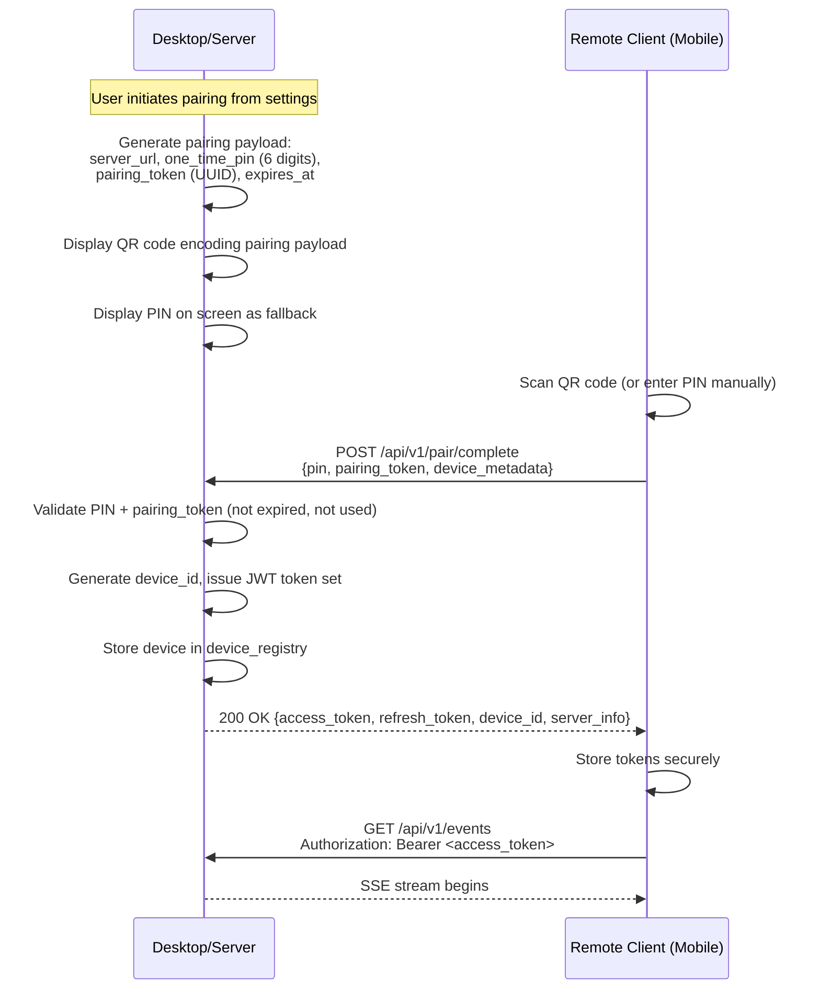
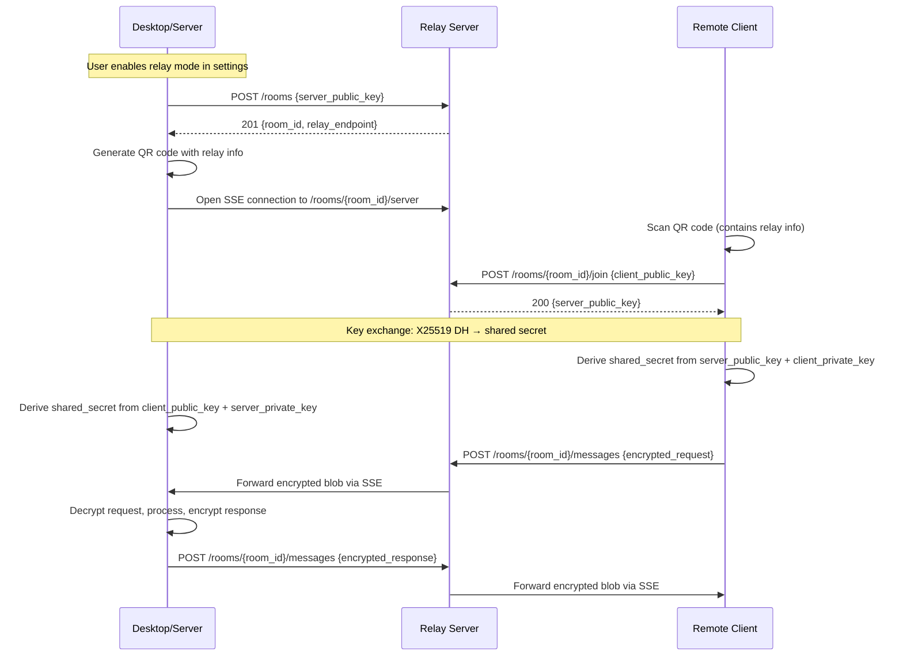
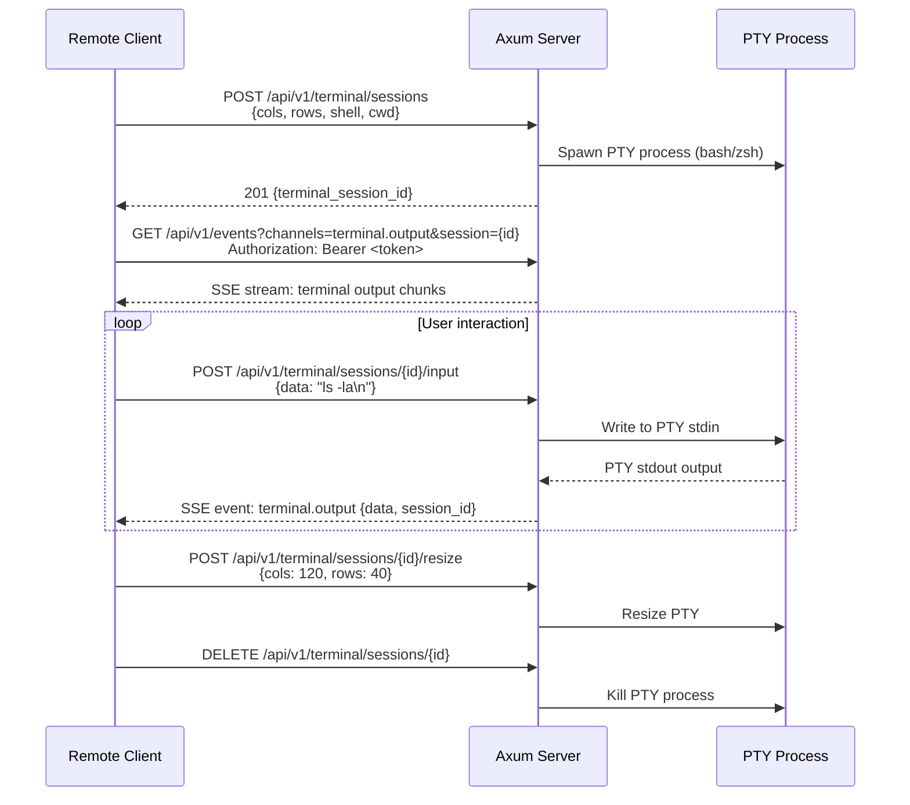

# Remote Control Protocol & Server Architecture

> **V2.0 — Remote Access:** Remote access is deferred until core agent orchestration (V1.5) is production-ready. V2.0 delivers LAN pairing first, then adds E2E encrypted relay. This document describes the complete V2.0 target architecture.

## Overview

Amoena's remote control architecture enables the paired React Native mobile app to connect to the desktop runtime for session management, agent monitoring, and terminal access. The design prioritizes simplicity: remote clients connect via REST + SSE (Server-Sent Events) over HTTP.

For non-LAN access, an E2E encrypted relay eliminates the need for VPNs or port forwarding.

Design goals:

- Direct connection to local Axum server (REST + SSE) — no intermediate proxy layers.
- QR code pairing with PIN + JWT authentication (inspired by Polyscope's device linking UX).
- E2E encrypted relay for internet access — no VPN required.
- Remote terminal access from the paired mobile app.
- Agent monitoring and task assignment from any connected client.
- Simple architecture — server handles all state natively, no session proxying needed.

References:

- `docs/architecture/system-architecture.md` (Axum server, Session Manager boundaries)
- `docs/architecture/data-model.md` (`device_registry` persistence and revocation)
- RFC 7519 (JWT), RFC 8895 (SSE)

## Connection Architecture

### Direct Connection (LAN)

Remote clients connect directly to the Axum HTTP server running on the local machine:

```
┌─────────────┐     REST + SSE      ┌──────────────────┐
│  Mobile App  │◀──────────────────▶│  Amoena Axum    │
│             │   (HTTP/HTTPS)      │  Server           │
└─────────────┘                     │  (desktop)        │
                                    └──────────────────┘
```

Transport:

- **REST API**: `https://<host>:47821/api/v1/*` for all control operations.
- **SSE**: `https://<host>:47821/api/v1/events` for real-time streaming (agent output, session lifecycle, notifications).
- SSE is preferred over WebSocket for streaming because it works over standard HTTP, simplifies reconnect handling, and matches the desktop/webview transport already used by the app.

### E2E Encrypted Relay (Non-LAN)

When clients cannot reach the local server directly (different networks, NAT, firewalls), an E2E encrypted relay bridges the connection:

```
┌─────────────┐       ┌──────────────────┐       ┌──────────────────┐
│  Remote      │◀─────▶│  Relay Server     │◀─────▶│  Amoena Axum    │
│  Client      │  E2E  │  (relay.amoena   │  E2E  │  Server           │
│              │  enc  │   .app)           │  enc  │  (local)          │
└─────────────┘       └──────────────────┘       └──────────────────┘
```

Relay design principles:

- **Zero-knowledge relay**: The relay server sees only opaque encrypted blobs. It cannot read request/response content, session data, or credentials.
- **E2E encryption**: Client and server establish a shared secret during QR code pairing. All traffic through the relay is encrypted with this key using XChaCha20-Poly1305.
- **No VPN required**: Users do not need Tailscale, WireGuard, or port forwarding. The relay handles NAT traversal transparently.
- **Self-hostable**: The relay server is open-source and can be self-hosted. A managed relay is available as an optional paid service.
- **Relay is optional**: LAN connections never touch the relay. The relay is only used when direct connection fails.

### SSE Event Channels

The SSE endpoint streams events on named channels:

- `session.stream` — agent/TUI output chunks (tokens, tool results)
- `session.lifecycle` — session started, stopped, failed, archived
- `session.permission` — pending/approved/denied permission prompts
- `agent.status` — subagent spawn, idle, completion events
- `agent.task` — active task assignment and handoff updates
- `agent.mailbox` — inter-agent mailbox traffic
- `agent.tool_activity` — current tool usage by active agents
- `terminal.output` — PTY output for remote terminal sessions
- `notification.dispatch` — mirrored from Notification Dispatcher
- `workspace.merge_required` — manual apply-back review required
- `workspace.merge_blocked` — apply-back blocked due to conflicts or policy
- `system.health` — runtime load, queue depth, API version

## QR Code Pairing Flow

Device pairing uses a QR code + PIN authentication flow inspired by Polyscope's device linking.

### Pairing Sequence



### QR Code Payload

The QR code encodes a JSON payload as a URL:

```
amoena://pair?host=192.168.1.42&port=47821&pin=847291&token=f8a3...&tls=true
```

| Field | Description |
| --- | --- |
| `host` | Server IP address or hostname |
| `port` | Server port (default: 47821) |
| `pin` | 6-digit one-time PIN |
| `token` | UUID pairing token for replay protection |
| `tls` | Whether TLS is required |

For relay connections, the QR code includes the relay endpoint:

```
amoena://pair?relay=relay.amoena.app&room=abc123&pin=847291&token=f8a3...
```

### PIN Authentication

- PIN is 6 digits, cryptographically random.
- PIN expires after 120 seconds (configurable).
- Maximum 3 PIN attempts per pairing session; after 3 failures, the pairing session is invalidated.
- PIN is rate-limited: 5 pairing attempts per IP per 10-minute window.

### JWT Token Model

After successful pairing:

- **Access token**: Short-lived JWT (default 15 minutes). Claims: `iss`, `sub` (device_id), `aud` (amoena-remote), `exp`, `iat`, `jti`, `scp` (scopes), `role`.
- **Refresh token**: Longer-lived JWT (default 30 days), bound to `device_id` and `token_family_id`.
- Token rotation on every refresh. Refresh token reuse detection invalidates the entire token family.
- Revocation by device, by token family, or global emergency revocation.

Authz scopes:

- `sessions:read`, `sessions:write`
- `agents:read`, `agents:control`
- `terminal:read`, `terminal:write`
- `files:read`, `files:write`
- `settings:read`, `settings:write`
- `admin:devices`

## Relay Connection Flow

### Establishing a Relay Session



### Relay Security Properties

- **Forward secrecy**: Each pairing session generates new X25519 key pairs. Compromising a relay session does not compromise past sessions.
- **Relay cannot decrypt**: The relay only forwards opaque blobs. No plaintext is ever available to the relay operator.
- **Room expiry**: Relay rooms expire after 24 hours of inactivity. Active rooms are kept alive by heartbeat.
- **No persistent storage**: The relay stores no message content. Room metadata (public keys, timestamps) is ephemeral.

## Remote Terminal Access

Remote clients can access a full terminal session running on the host machine through the paired mobile app.

### Terminal Session Flow



### Terminal Security

- Terminal sessions require `terminal:write` scope in the JWT token.
- Output is sanitized: dangerous control sequences (e.g., title-set escapes that could confuse the remote client) are stripped.
- Idle terminal sessions are killed after configurable timeout (default: 30 minutes).
- Maximum concurrent terminal sessions per device: 3 (configurable).

## Agent Monitoring and Task Assignment

Remote clients have full visibility into running agents and can assign tasks from any connected device.

### Agent Monitoring

- **Real-time status**: SSE `agent.status` channel streams agent state changes (running, idle, waiting for permission, completed).
- **Output streaming**: SSE `session.stream` channel delivers agent output tokens in real-time.
- **Permission handling**: Remote clients can approve/deny permission requests via `POST /api/v1/sessions/{id}/permissions/{perm_id}` with `approve` or `deny` action.
- **Cost tracking**: Agent sessions include live token count and cost estimate in status events.

Canonical agent event payloads:

```ts
interface AgentStatusEvent {
  sessionId: string;
  agentId: string;
  label: string;
  role: string;
  status: "idle" | "thinking" | "executing" | "waiting-approval" | "completed";
  reasoningMode: "off" | "auto" | "on";
}

interface AgentTaskEvent {
  sessionId: string;
  agentId: string;
  task: string;
  detail?: string;
}

interface AgentMailboxEvent {
  sessionId: string;
  fromAgentId: string;
  toAgentId?: string;
  message: string;
  timestamp: string;
}

interface AgentToolActivityEvent {
  sessionId: string;
  agentId: string;
  toolName: string;
  state: "running" | "complete" | "error";
  summary: string;
}
```

### Task Assignment

- **Create session**: `POST /api/v1/sessions` with agent type, model, prompt, and working directory.
- **Send message**: `POST /api/v1/sessions/{id}/messages` to send follow-up prompts.
- **Interrupt**: `POST /api/v1/sessions/{id}/interrupt` to stop an agent mid-execution.
- **Queue tasks**: `POST /api/v1/tasks` to queue tasks for execution when an agent becomes available.

## REST API Reference

### Pairing

- `POST /api/v1/pair/start` — Generate pairing PIN and QR code payload.
- `POST /api/v1/pair/complete` — Exchange PIN for JWT token set.

### Authentication

- `POST /api/v1/auth/refresh` — Rotate JWT tokens.
- `POST /api/v1/auth/revoke` — Revoke current or target device.

### Devices

- `GET /api/v1/devices` — List paired devices.
- `DELETE /api/v1/devices/{device_id}` — Revoke device and invalidate tokens.

### Sessions

- `GET /api/v1/sessions` — List active and recent sessions.
- `POST /api/v1/sessions` — Create and start a new session.
- `GET /api/v1/sessions/{id}` — Get session details and status.
- `POST /api/v1/sessions/{id}/messages` — Send message to session.
- `POST /api/v1/sessions/{id}/interrupt` — Interrupt running session.
- `POST /api/v1/sessions/{id}/stop` — Stop session.
- `POST /api/v1/sessions/{id}/permissions/{perm_id}` — Approve/deny permission.

`POST /api/v1/sessions/{id}/messages` request shape:

```json
{
  "content": "Review these auth changes",
  "references": [
    {
      "type": "file_ref",
      "name": "auth.ts",
      "path": "src/auth.ts",
      "status": "modified",
      "previewSnippet": "export async function refreshToken() { ... }"
    },
    {
      "type": "folder_ref",
      "name": "src/auth",
      "path": "src/auth",
      "itemCount": 12,
      "truncated": true,
      "inferredTypes": ["ts", "tsx", "json"]
    }
  ],
  "reasoningMode": "auto",
  "reasoningEffort": "high"
}
```

### Agents

- `GET /api/v1/agents` — List available agent types.
- `GET /api/v1/agents/status` — Get status of all running agents.

### Tasks

- `GET /api/v1/tasks` — List queued and completed tasks.
- `POST /api/v1/tasks` — Queue a new task.
- `DELETE /api/v1/tasks/{task_id}` — Cancel queued task.

### Workspaces

- `GET /api/v1/workspaces` — List workspaces and merge-review state.
- `GET /api/v1/workspaces/{id}` — Get workspace metadata and current diff summary.
- `POST /api/v1/workspaces/{id}/archive` — Archive a workspace without deleting files.
- `DELETE /api/v1/workspaces/{id}` — Destroy a workspace and remove tracked state.
- `POST /api/v1/workspaces/{id}/merge-review` — Request an apply-back review payload.
- `POST /api/v1/workspaces/{id}/apply` — Finalize a reviewed merge/apply-back operation.

`POST /api/v1/workspaces/{id}/merge-review` response shape:

```json
{
  "workspaceId": "wrk_auth-review",
  "sourceBranch": "feat/auth-review",
  "targetBranch": "main",
  "changedFiles": 4,
  "conflicts": 0,
  "summary": "Manual review required before applying the workspace back to main.",
  "files": [
    { "path": "src/auth.ts", "status": "modified" },
    { "path": "src/tokens.ts", "status": "added" }
  ]
}
```

`POST /api/v1/workspaces/{id}/apply` request shape:

```json
{
  "approved": true,
  "targetBranch": "main",
  "preserveWorkspace": false
}
```

### Terminal

- `POST /api/v1/terminal/sessions` — Create remote terminal session.
- `POST /api/v1/terminal/sessions/{id}/input` — Send input to terminal.
- `POST /api/v1/terminal/sessions/{id}/resize` — Resize terminal.
- `DELETE /api/v1/terminal/sessions/{id}` — Close terminal session.

### Files

- `GET /api/v1/files` — List files (scoped to allowed workspace roots).
- `GET /api/v1/files/content` — Read file content.
- `PUT /api/v1/files/content` — Write file (requires `files:write` scope).

### Settings

- `GET /api/v1/settings` — Read settings.
- `PATCH /api/v1/settings` — Update settings (requires `settings:write` scope).

### System

- `GET /api/v1/health` — Health check and build metadata.
- `GET /api/v1/events` — SSE event stream (requires valid JWT).

## Security Model

### Transport Security

- TLS 1.3 required for all non-localhost connections.
- Self-signed certificates with TOFU (Trust On First Use) for LAN.
- Certificate fingerprint is embedded in QR code for verification.
- For internet-facing deployments: use CA-issued certificates (Let's Encrypt via reverse proxy).

### Authentication Security

- JWT token validation: issuer, audience, expiry, revocation checks on every request.
- Refresh token rotation on every use; reuse detection invalidates the token family.
- Device revocation immediately terminates all active SSE connections for that device.
- IP-based and device-based rate limiting on pairing and auth endpoints.
- Replay protection using `jti` claim + nonce cache for sensitive operations.

### Relay Security

- E2E encryption: XChaCha20-Poly1305 with X25519 key exchange.
- Forward secrecy: new key pairs per pairing session.
- Zero-knowledge relay: operator cannot read traffic content.
- Room expiry and heartbeat to prevent stale connections.

### Audit Logging

- All auth events (pair, refresh, revoke, failure) are logged with device ID and IP.
- All session mutations (create, send, interrupt, stop) are logged with actor.
- All file writes are logged with path, actor, and content hash.
- All permission decisions (approve/deny) are logged with actor and context.
- Logs redact token values and sensitive payload content.

## Configuration

Config file locations:

- Linux: `/etc/amoena/server.toml`
- macOS: `/usr/local/etc/amoena/server.toml`
- User mode: `~/.config/amoena/server.toml`

Precedence: CLI flags > environment variables > config file > defaults.

Key settings:

| Setting | Default | Description |
| --- | --- | --- |
| `server.bind_address` | `127.0.0.1` | Listen address |
| `server.port` | `47821` | HTTP port |
| `remote_access.enabled` | `false` | Enables paired-device remote access |
| `remote_access.lan.enabled` | `false` | Enables the opt-in LAN listener |
| `remote_access.lan.bind_address` | `0.0.0.0` | Bind address for the LAN listener when enabled |
| `server.tls_cert_path` | — | TLS certificate path |
| `server.tls_key_path` | — | TLS private key path |
| `auth.jwt_access_ttl` | `15m` | Access token lifetime |
| `auth.jwt_refresh_ttl` | `30d` | Refresh token lifetime |
| `auth.pairing_pin_ttl` | `120s` | PIN expiration |
| `relay.enabled` | `false` | Enable relay connections |
| `relay.endpoint` | `relay.amoena.app` | Relay server URL |
| `terminal.idle_timeout` | `30m` | Terminal session idle timeout |
| `terminal.max_sessions` | `3` | Max concurrent terminal sessions per device |

Environment variable examples:

- `AMOENA_REMOTE_ACCESS_ENABLED=true`
- `AMOENA_REMOTE_LAN_ENABLED=true`
- `AMOENA_REMOTE_LAN_BIND=0.0.0.0`
- `AMOENA_SERVER_PORT=47821`
- `AMOENA_TLS_CERT=/run/secrets/tls.crt`
- `AMOENA_TLS_KEY=/run/secrets/tls.key`
- `AMOENA_RELAY_ENABLED=true`

## Deployment Scenarios

### Desktop + Remote Apps

- Desktop app runs the Axum server on `localhost:47821`.
- Paired mobile clients use QR code pairing and may connect directly on LAN when remote access is enabled.
- For remote access: enable relay mode in settings.

### Headless Server

- `amoena-server` runs as a background daemon.
- All control is via REST API + SSE from remote clients.
- No GUI dependencies.

### Docker Container

```bash
docker run -d \
  --name amoena-server \
  -p 47821:47821 \
  -v /opt/amoena/config:/etc/amoena \
  -v /opt/amoena/data:/var/lib/amoena \
  -v /opt/amoena/certs:/run/secrets \
  -e AMOENA_SERVER_PORT=47821 \
  -e AMOENA_TLS_CERT=/run/secrets/tls.crt \
  -e AMOENA_TLS_KEY=/run/secrets/tls.key \
  ghcr.io/amoena/amoena-server:latest
```

### Cloud VPS

- Prefer private network + VPN (Tailscale/WireGuard) for simplicity.
- Alternatively, enable the E2E encrypted relay — no VPN needed.
- If directly exposed: enforce TLS, strict firewall rules, rate limiting.
