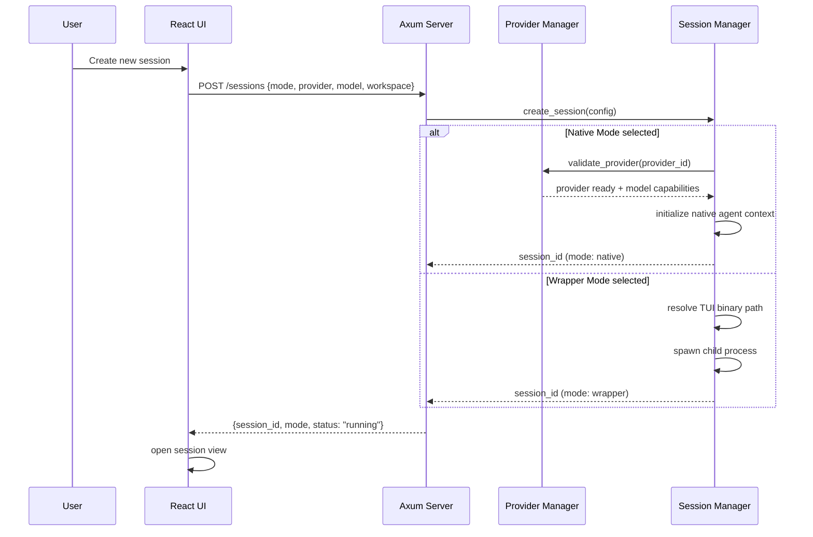
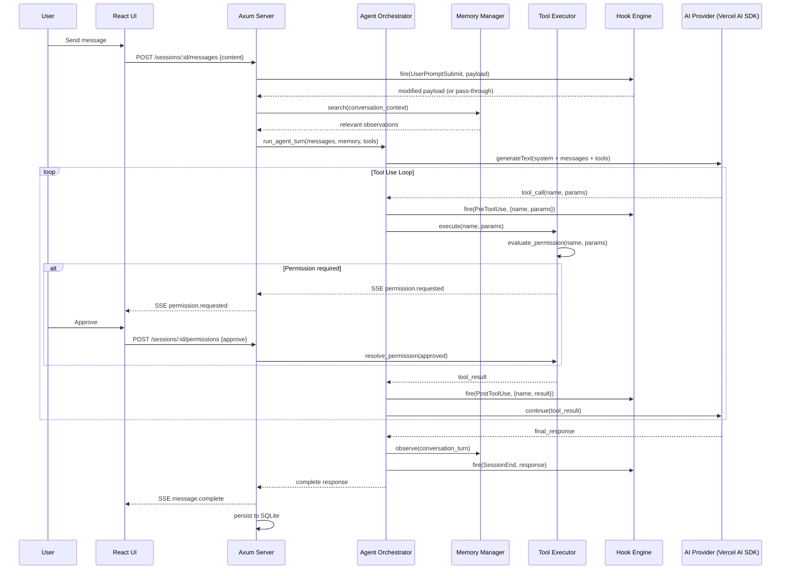
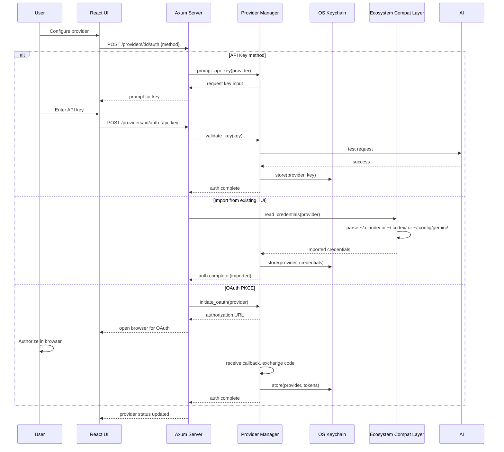
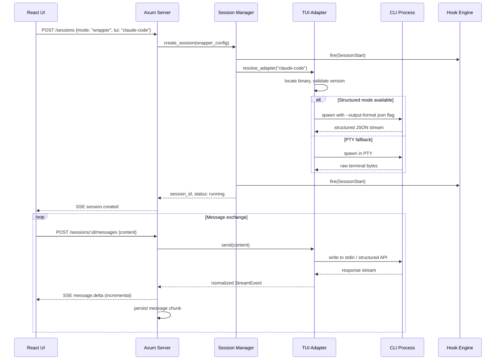
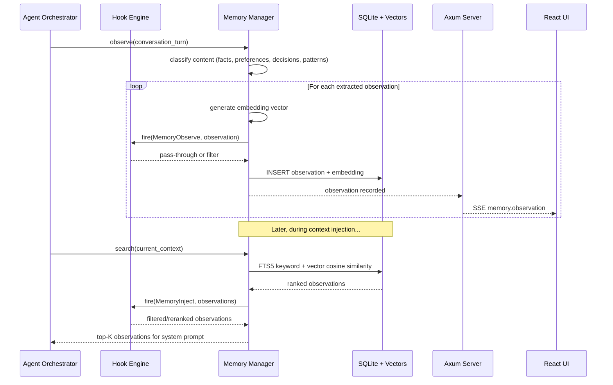
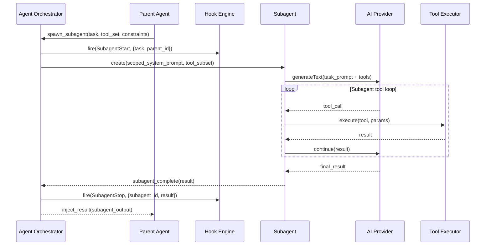
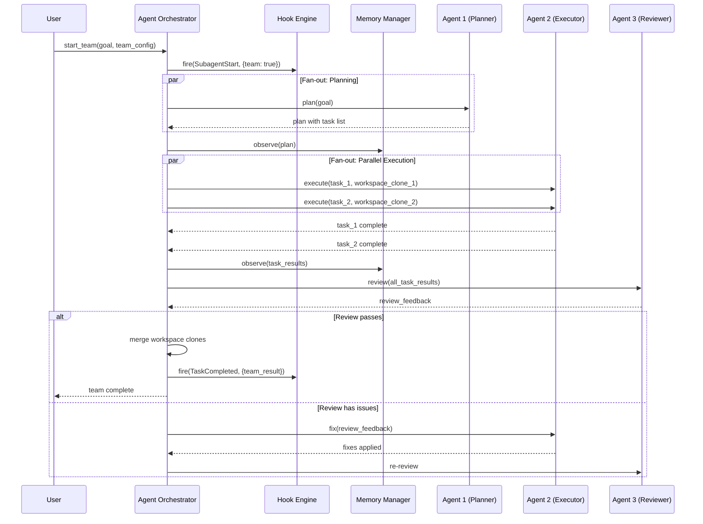
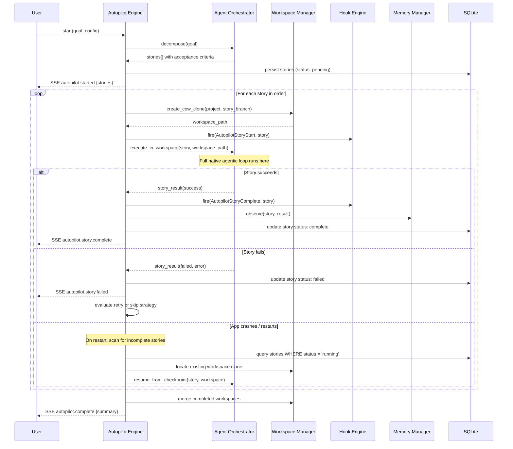

# Lunaria System Architecture

## Scope

This document defines Lunaria's runtime architecture for the desktop app (Tauri v2 + React 19), including the dual-mode process model, the local Axum HTTP server, all major subsystem components, inter-process communication, state management, security controls, and key runtime sequences.

## Process Model

Lunaria runs as a multi-process desktop system with a **Dual IPC strategy**: local operations use Tauri native `invoke()` for zero-copy, in-process communication with the Rust backend, while an Axum HTTP server acts as a **remote coordination layer** activated only when remote access is enabled. The Tauri main process hosts all core managers and is the **state authority** for the local desktop — the Axum server is not the single source of truth for local operations.

Five primary execution domains:

1. **Tauri Main Process (Rust) — State Authority**
   - Bootstraps the application, creates the webview, and manages native OS integrations (system tray, notifications, file dialogs, window management).
   - **Hosts core managers as Rust modules**: Provider Manager, Memory Manager, Agent Orchestrator, Workspace Manager, Tool Executor, Hook Engine, Session Manager, Autopilot Engine, Opinions Engine, Visual Workflow Engine, and Ecosystem Compat Layer.
   - Exposes Tauri commands (`invoke`) for **zero-copy local IPC** with command allowlist security defined in Tauri capabilities. This is the **primary IPC surface for all local operations**.
   - Manages SQLite database, JSON config persistence, and in-memory caches.
   - Emits Tauri events to the webview for real-time updates: session output streaming, agent progress, memory events, permission requests, and lifecycle changes.
   - Owns Tauri capabilities and CSP policy enforcement.

2. **Remote Access Server (Axum) — Remote Coordination Layer**
   - Activated **only when remote access is enabled** in settings. Not started for local-only desktop usage.
   - **Proxies requests from paired mobile/remote clients to the same core managers hosted in the Tauri main process.** Does not own state independently — all mutations and queries are delegated to the Tauri main process managers.
   - Exposes a REST + SSE API on a localhost port (randomized per launch) as the remote surface for paired mobile clients and optional LAN access.
   - Accepts connections from paired mobile clients via the remote control surface (E2E encrypted relay or opt-in LAN listener).

3. **Webview Process (React 19 + Zustand)**
   - Renders UI and orchestrates user interactions using shadcn/ui, Monaco editor, Tailwind v4 with OKLCH palette (#B800B8 magenta accent).
   - Uses **Tauri `invoke()` for all local operations**: mutations, queries, session commands, permission approvals, and tool execution.
   - Subscribes to **Tauri events for real-time updates** (session output streaming, agent progress, memory events, permission requests).
   - Maintains Zustand store slices as a client-side cache of Tauri main process state.

4. **Child Processes (Wrapper Mode)**
   - Per-session child process for Claude Code, OpenCode, Codex CLI, or Gemini CLI.
   - Structured mode uses CLI API channels (WebSocket, REST, JSON-RPC, SSE, JSON lines).
   - PTY mode uses terminal emulation for full raw terminal interaction via xterm.js.
   - Managed by the Tauri main process Session Manager; output streamed to clients via Tauri events (desktop) or SSE (remote).

5. **Native AI Worker (Bun)**
   - Persistent Bun daemon used for Vercel AI SDK interactions required by native mode.
   - Owns provider SDK instantiation, streaming generation, embeddings, and model-factory calls.
   - Communicates with the Tauri main process through a typed internal IPC contract; the Tauri main process remains the source of truth for sessions, permissions, tools, and persistence.

### Latency Budget

| Path | Target p95 | Notes |
|------|-----------|-------|
| Local IPC (Tauri `invoke`) | < 50ms | Zero-copy, in-process |
| Remote HTTP (Axum) | < 100ms | Network + serialization |
| SSE event delivery | < 20ms | From core manager emit to webview render |

### Dual-Mode Execution

Lunaria supports two fundamentally different execution modes behind one unified UX surface:

**Wrapper Mode** spawns external TUI CLI tools as child processes, acting as a GUI shell around existing AI coding assistants. The user's chosen TUI (Claude Code, OpenCode, Codex CLI, Gemini CLI) runs as a child process with Lunaria mediating I/O.

**Native Mode** runs Lunaria's own agentic loop. The Tauri main process owns session state and orchestration, while a persistent Bun daemon performs the Vercel AI SDK v5 provider calls needed for streaming generation and embeddings. No external CLI binary is required. Native mode enables full control over the agent lifecycle: subagent spawning, team coordination, memory injection, tool execution, hooks, and autopilot workflows.

Both modes produce the same `Session` and `StreamEvent` contracts, share the same message timeline UI, and write to the same persistence layer. Users can switch modes per session.

### Dual IPC Strategy

Local and remote clients use different communication paths optimized for their latency requirements:

| Client | Write Path | Read Path (Streaming) | Latency Target |
| --- | --- | --- | --- |
| Desktop Webview | Tauri `invoke()` (zero-copy IPC) | Tauri events (in-process push) | p95 < 50 ms |
| Remote Mobile | Axum HTTP `POST` (E2E encrypted) | Axum SSE (E2E encrypted) | p95 < 100 ms |

The desktop webview uses Tauri `invoke()` for all command-and-control operations (send message, approve permission, switch agent, update settings) and Tauri events for receiving real-time streaming output (session tokens, agent progress, memory events). Remote mobile clients use Axum HTTP for both reads and writes since they cannot access Tauri IPC — the Axum server proxies all requests to the same core managers in the Tauri main process.

### Process Communication Overview

```
┌──────────────────────────────────────────────────────────────────────────┐
│                         Lunaria Desktop App                              │
│                                                                          │
│  ┌──────────────────────┐    ┌─────────────────────────────────────────┐ │
│  │  Webview (React)      │    │  Tauri Main Process — State Authority   │ │
│  │  ├─ Zustand Cache     │    │  (Rust)                                 │ │
│  │  ├─ UI Screens        │    │  ├─ Provider Manager                    │ │
│  │  ├─ Monaco Editor     │    │  ├─ Memory Manager (claude-mem)         │ │
│  │  └─ xterm.js          │    │  ├─ Agent Orchestrator                  │ │
│  └───┬──────────┬────────┘    │  ├─ Workspace Manager (CoW)             │ │
│      │          │             │  ├─ Tool Executor                       │ │
│      │ invoke() │ Tauri       │  ├─ Hook Engine                          │ │
│      │ (cmds +  │ events      │  ├─ Session Manager                     │ │
│      │  queries)│ (streaming) │  ├─ Autopilot Engine                    │ │
│      │          │             │  ├─ Opinions Engine                     │ │
│      │          │             │  ├─ Ecosystem Compat Layer              │ │
│      │          │             │  ├─ Window / Tray / OS                  │ │
│      │          │             │  └─ SQLite + JSON Config                │ │
│      │          │             └──────┬──────────────┬──────────────────┘ │
│      │          │                    │              │                     │
│      └──────┬───┘    ┌───────────────┘   ┌─────────┘                     │
│             │        │ typed IPC         │ spawn / structured / PTY      │
│             │        ▼                   ▼                                │
│             │      ┌────────────┐  ┌──────────────────────────────────┐  │
│             │      │ Bun Daemon │  │  Child Processes (Wrapper Mode)  │  │
│             │      │ (Vercel AI │  │  Claude Code │ OpenCode │ Codex  │  │
│             │      │  SDK v5)   │  │  CLI │ Gemini CLI                │  │
│             │      └────────────┘  └──────────────────────────────────┘  │
│             │                                                            │
│             ▼                                                            │
│  ┌──────────────────────────────────────────────┐                        │
│  │  Remote Access Server (Axum)                  │                        │
│  │  ├─ REST API (proxies to Tauri main process  │                        │
│  │  │   core managers)                           │                        │
│  │  ├─ SSE streaming (remote clients only)      │                        │
│  │  └─ E2E encrypted relay                      │                        │
│  │  (activated only when remote access enabled)  │                        │
│  └──────────────────────┬───────────────────────┘                        │
└──────────────────────────┼───────────────────────────────────────────────┘
                           │ REST + SSE (E2E encrypted)
                           ▼
                      ┌─────────────┐
                      │ Mobile      │
                      │ (React Native) │
                      └─────────────┘
```

## IPC Architecture

### Communication Paths

| Path | Transport | Purpose |
| --- | --- | --- |
| Webview → Tauri Main | Tauri `invoke` (zero-copy IPC) | All local mutations, queries, session commands, permission approvals |
| Tauri Main → Webview | Tauri events | Real-time streaming output (tokens, tool calls, agent progress), permission requests, lifecycle changes |
| Tauri Main → Bun Daemon | Typed internal IPC | Vercel AI SDK provider calls (streaming generation, embeddings) |
| Tauri Main → Child Processes | stdin/stdout, WebSocket, HTTP, JSON-RPC | Wrapper mode TUI communication |
| Mobile → Axum Server | REST + SSE (remote, via relay or opt-in LAN listener) | Paired mobile control surface |
| Axum Server → Tauri Main | Internal delegation | Remote requests forwarded to core managers |
| Axum Server → Remote Relay | WebSocket (E2E encrypted) | Cloud relay for remote access |

### Axum Server REST Surface

| Endpoint Group | Owner | Purpose |
| --- | --- | --- |
| `POST /sessions` | Session Manager | Create session (wrapper or native mode) |
| `POST /sessions/:id/messages` | Session Manager + Agent Orchestrator | Send user message, trigger agent loop |
| `GET /sessions/:id/stream` | Session Manager | SSE stream for session output |
| `POST /sessions/:id/cancel` | Session Manager | Interrupt active generation |
| `POST /sessions/:id/permissions` | Tool Executor | Approve or deny pending permission |
| `GET /providers` | Provider Manager | List configured providers and models |
| `GET /providers/:id/models` | Provider Manager | List provider models with capability metadata and reasoning support |
| `POST /providers/:id/auth` | Provider Manager | Initiate OAuth or API key auth flow |
| `GET /memory/search` | Memory Manager | Search observations with query |
| `POST /memory/observe` | Memory Manager | Record manual observation |
| `GET /workspaces` | Workspace Manager | List workspaces and worktrees |
| `POST /workspaces/:id/clone` | Workspace Manager | Create CoW clone for parallel work |
| `POST /workspaces/:id/merge-review` | Workspace Manager | Create or refresh a manual apply-back review |
| `POST /workspaces/:id/apply` | Workspace Manager | Finalize a reviewed apply-back operation |
| `POST /autopilot/start` | Autopilot Engine | Start goal-driven autonomous execution |
| `POST /autopilot/:id/pause` | Autopilot Engine | Pause running autopilot |
| `POST /opinions/query` | Opinions Engine | Submit multi-model committee query |
| `GET /hooks` | Hook Engine | List registered hooks and handlers |
| `POST /tools/execute` | Tool Executor | Manual tool invocation |
| `GET /compat/claude` | Ecosystem Compat Layer | Read resolved Claude Code config |
| `GET /compat/opencode` | Ecosystem Compat Layer | Read resolved OpenCode config |
| `GET /plugins` | Plugin Ecosystem Manager | List discovered plugins (both ecosystems) |
| `PUT /plugins/:id/enabled` | Plugin Ecosystem Manager | Enable or disable a specific plugin |
| `PUT /plugins/ecosystem/:name` | Plugin Ecosystem Manager | Enable/disable all plugins in an ecosystem |
| `GET /plugins/:id/health` | Plugin Ecosystem Manager | Plugin health and error log |
| `GET /agents/profiles` | Agent Orchestrator | List available agent profiles (all sources) |
| `PUT /agents/profiles/active` | Agent Orchestrator | Switch active agent tab |
| `PUT /settings` | Settings Manager | Update global or scoped settings |
| `GET /settings` | Settings Manager | Read merged settings |

**Important request/response shapes used by multiple clients:**

```ts
interface SendSessionMessageRequest {
  content: string;
  files?: FileInput[];
  images?: ImageInput[];
  audio?: AudioInput[];
  references?: Array<{
    type: "file_ref" | "folder_ref";
    name: string;
    path: string;
    status?: "modified" | "added" | "deleted" | "renamed";
    previewSnippet?: string;
    itemCount?: number;
    truncated?: boolean;
    inferredTypes?: string[];
  }>;
  reasoningMode?: "off" | "auto" | "on";
  reasoningEffort?: "low" | "medium" | "high";
}

interface ProviderModelSummary {
  providerId: string;
  modelId: string;
  displayName: string;
  supportsReasoning: boolean;
  reasoningModes: Array<"off" | "auto" | "on">;
  reasoningEffortSupported: boolean;
  reasoningEffortValues?: Array<"low" | "medium" | "high">;
  reasoningTokenBudgetSupported: boolean;
}

interface WorkspaceMergeReviewSummary {
  workspaceId: string;
  sourceBranch: string;
  targetBranch: string;
  changedFiles: number;
  conflicts: number;
  summary: string;
}
```

### Tauri Command Surface (Local IPC)

Tauri `invoke()` is the primary write path for the desktop webview. All commands are secured via the Tauri command allowlist defined in capabilities.

| Command | Purpose |
| --- | --- |
| `get_server_port` | Return Axum SSE server localhost port to webview |
| `send_message` | Send user message to active session, trigger agent loop |
| `approve_permission` | Synchronously approve a pending permission request by `request_id` |
| `deny_permission` | Synchronously deny a pending permission request by `request_id` |
| `interrupt_session` | Interrupt active generation for a session |
| `create_session` | Create session (wrapper or native mode) |
| `cancel_session` | Cancel / end an active session |
| `switch_agent` | Switch active agent profile tab |
| `update_settings` | Update global or scoped settings |
| `get_providers` | List configured providers and models |
| `get_sessions` | List sessions with metadata |
| `search_memory` | Search memory observations |
| `show_window` / `hide_window` | Window visibility control |
| `tray_action` | System tray menu interactions |
| `open_file_dialog` | Native file picker |
| `show_notification` | OS-level notification |
| `get_platform_info` | OS type, arch, version |

### Event Channels

Core managers emit structured events that are delivered via **Tauri events** to the desktop webview and via **Axum SSE** to remote clients. Both transports carry the same event types.

- **Session channel** (Tauri: `session:{id}:*` events / Axum: `/sessions/:id/stream`): `message.delta`, `message.complete`, `tool.start`, `tool.result`, `permission.requested`, `permission.resolved`, `agent.spawned`, `agent.completed`, `agent.status`, `agent.task`, `agent.tool_activity`, `agent.mailbox`, `error`
- **Global channel** (Tauri: `global:*` events / Axum: `/events`): `session.created`, `session.updated`, `session.ended`, `memory.observation`, `autopilot.progress`, `autopilot.story.complete`, `workspace.changed`, `workspace.merge_required`, `workspace.merge_blocked`, `settings.changed`, `hook.fired`, `provider.status`

Additional structured events used by desktop and remote clients:

```ts
interface AgentStatusEvent {
  sessionId: string;
  agentId: string;
  label: string;
  role: "planner" | "architect" | "reviewer" | "builder" | string;
  status: "idle" | "thinking" | "executing" | "waiting-approval" | "completed";
  reasoningMode: "off" | "auto" | "on";
}

interface AgentTaskEvent {
  sessionId: string;
  agentId: string;
  task: string;
  detail?: string;
}

interface AgentToolActivityEvent {
  sessionId: string;
  agentId: string;
  toolName: string;
  state: "running" | "complete" | "error";
  summary: string;
}

interface WorkspaceMergeRequiredEvent {
  sessionId: string;
  workspaceId: string;
  sourceBranch: string;
  targetBranch: string;
  changedFiles: number;
  conflicts: number;
  summary: string;
}
```

### Streaming Architecture — Split Read/Write Channels

Streaming uses a split-channel design where the transport differs by client type. Desktop clients receive events via **Tauri events** (in-process push, no HTTP overhead), while remote clients receive the same event types over **Axum SSE**. The send path (client-to-server) also varies: desktop uses Tauri `invoke()`, remote uses Axum HTTP POST.

#### Receive Channel (Server → Client)

All event types are shared across transports. The core managers emit events once; the transport layer routes them to the appropriate channel.

| Event Type | Payload | Description |
| --- | --- | --- |
| `token` | `{ delta: string, index: number }` | Incremental token chunk from the model |
| `tool_call` | `{ toolName: string, params: object, callId: string }` | Agent is invoking a tool |
| `tool_result` | `{ callId: string, result: object, error?: string }` | Tool execution completed |
| `control_request` | `{ requestId: string, action: string, description: string }` | Permission approval needed |
| `usage` | `{ inputTokens: number, outputTokens: number, cost?: number }` | Token usage for the turn |
| `error` | `{ code: string, message: string, retryable: boolean }` | Error in the agent loop |
| `done` | `{ sessionId: string, reason: string }` | Agent turn completed |

#### Send Channel (Client → Server)

| Action | Desktop (Tauri `invoke`) | Remote (Axum HTTP) |
| --- | --- | --- |
| Approve permission | `invoke("approve_permission", { request_id })` | `POST /api/v1/sessions/{id}/approve` `{ request_id }` |
| Deny permission | `invoke("deny_permission", { request_id })` | `POST /api/v1/sessions/{id}/deny` `{ request_id }` |
| Interrupt generation | `invoke("interrupt_session", { session_id })` | `POST /api/v1/sessions/{id}/interrupt` |
| Send message | `invoke("send_message", { session_id, content, files? })` | `POST /api/v1/sessions/{id}/messages` `{ content, files? }` |

Desktop approvals via `invoke()` are **synchronous** — the Rust backend resolves the pending permission immediately in the same process, with no HTTP round-trip. Remote approvals via HTTP POST carry the additional network latency but use the same underlying permission resolution logic.

### Bidirectional Communication Channels

The streaming architecture uses split read/write channels optimized per client type:

**Receive (read-only, push from server):**

| Channel | Transport | Events |
|---------|-----------|--------|
| Desktop | Tauri events | `token`, `tool_call`, `tool_result`, `control_request`, `usage`, `error`, `done` |
| Remote | SSE stream | Same event types over HTTP |

**Send (write, client-initiated):**

| Action | Desktop Transport | Remote Transport |
|--------|-------------------|------------------|
| Approve permission | `invoke("approve_permission", { request_id })` | `POST /api/v1/sessions/{id}/approve` |
| Deny permission | `invoke("deny_permission", { request_id })` | `POST /api/v1/sessions/{id}/deny` |
| Interrupt generation | `invoke("interrupt_session", { session_id })` | `POST /api/v1/sessions/{id}/interrupt` |
| Send message | `invoke("send_message", { session_id, content })` | `POST /api/v1/sessions/{id}/messages` |

For desktop: approvals are synchronous via Tauri invoke — no HTTP round-trip needed.
For remote: approvals travel over the Axum HTTP surface with the same semantic guarantees.

#### Bidirectional Flow

```
Desktop Webview                  Tauri Main Process
     │                                │
     │  invoke("send_message")        │
     ├───────────────────────────────►│
     │         (zero-copy IPC)        │  delegate to Agent
     │                                │  Orchestrator
     │                                │
     │          Tauri event: token     │
     │◄───────────────────────────────┤
     │          Tauri event: tool_call │
     │◄───────────────────────────────┤
     │          Tauri event: ctrl_req  │
     │◄───────────────────────────────┤
     │                                │
     │  invoke("approve_permission")  │
     ├───────────────────────────────►│
     │     (synchronous resolve)      │
     │                                │
     │          Tauri event: tool_rslt │
     │◄───────────────────────────────┤
     │          Tauri event: usage     │
     │◄───────────────────────────────┤
     │          Tauri event: done      │
     │◄───────────────────────────────┤
     │                                │

Remote Mobile                                                   Axum Server
     │                                                               │
     │  POST /api/v1/sessions/{id}/messages                          │
     ├──────────────────────────────────────────────────────────────►│
     │         (E2E encrypted HTTP)                                  │
     │                                            SSE: token         │
     │◄─────────────────────────────────────────────────────────────┤
     │                                            SSE: control_req   │
     │◄─────────────────────────────────────────────────────────────┤
     │  POST /api/v1/sessions/{id}/approve                           │
     ├──────────────────────────────────────────────────────────────►│
     │         (E2E encrypted HTTP)                                  │
     │                                            SSE: tool_result   │
     │◄─────────────────────────────────────────────────────────────┤
     │                                            SSE: done          │
     │◄─────────────────────────────────────────────────────────────┤
     │                                                               │
```

## Major Components

### Provider Manager

Manages authentication, model registry, and API key storage for all AI providers.

- **Auth flows**: API key entry, OAuth 2.0 PKCE (for providers that support it), and credential import from existing TUI configs (reads Claude Code's `~/.claude/` credentials, Codex CLI config, Gemini CLI auth).
- **Model registry**: Maintains a catalog of available models per provider with capability metadata (vision, tool use, extended thinking, max context window).
- **Reasoning capability model**: Provider/model metadata includes whether a model supports reasoning, which reasoning modes are available (`off`, `auto`, `on`), whether effort levels are supported, and whether reasoning-token budgets are exposed to the client.
- **API key storage**: Keys stored in the OS keychain via Tauri's secure storage plugin. Never written to SQLite or JSON config.
- **Provider abstraction**: In native mode, delegates to Vercel AI SDK v5 provider instances (`@ai-sdk/anthropic`, `@ai-sdk/openai`, `@ai-sdk/google`). In wrapper mode, the child process handles its own auth.
- **Local model support**: Connects to locally-running inference servers for small, fast models (Qwen 3.5, Phi-4, Llama 3.2, Gemma 3, etc.) ideal for simple tasks like commit messages, code formatting, file renaming, and quick lookups. Supports Ollama (`@ai-sdk/ollama` or OpenAI-compatible endpoint), llama.cpp server, LM Studio, and any OpenAI-compatible local server. Local models require no API keys, no internet, and have zero cost. Auto-detected via well-known ports (Ollama on 11434, LM Studio on 1234) or user-configured endpoints in `lunaria.json`. Users can assign local models as the default for lightweight agent tasks (title generation, compaction summaries, observation classification) while reserving cloud models for complex reasoning.
- **Reasoning defaults**: User defaults are stored per provider/model. Per-turn overrides take precedence over per-model defaults, which take precedence over the adaptive auto-policy.

### Agent Orchestrator

Runs Lunaria's native agentic loop using the Vercel AI SDK v5. Only active in native mode.

- **Agentic loop**: Implements a tool-use loop (`generateText` with `maxSteps`) where the model calls tools, Lunaria executes them, and results feed back until the model produces a final response or hits the step limit.
- **Tab-switchable agents**: Users switch between active agent profiles via keyboard tabs (like OpenCode's Tab key) or the composer's agent tab switcher. Each tab represents a different agent persona (e.g., Build, Plan, Explore, Review) with its own system prompt, tool access, and permission config. Agent profiles are sourced from: built-in defaults, Claude Code's `.claude/agents/` definitions, OpenCode's agent config, oh-my-claudecode agent catalog, oh-my-opencode agent catalog, and user-defined custom agents. Switching tabs mid-session preserves conversation history but changes the active agent's behavior for subsequent turns.
- **Subagent spawning**: Creates child agent contexts with scoped tool sets, isolated conversation history, and constrained system prompts. Subagents run concurrently with independent context windows.
- **Team coordination**: Orchestrates multiple agents working on related tasks. Supports fan-out (parallel execution) and pipeline (sequential handoff) patterns. Coordinates via shared memory observations.
- **System prompt assembly**: Composes the system prompt from: base instructions + Ecosystem Compat Layer rules (CLAUDE.md, .agents/, opencode.json agents) + active plugin instructions + Memory Manager context injection + Hook Engine pre-prompt hooks + workspace-specific context.
- **Context window management**: Tracks token usage per conversation turn. Implements context compaction (summarize older messages) when approaching the model's context limit.
- **Adaptive reasoning policy**: When a model supports reasoning, the orchestrator resolves reasoning mode in this order: per-turn override -> per-model default -> adaptive auto-policy. Auto mode enables reasoning for planning, architecture, debugging, review, and complex multi-file tasks, and disables it for lightweight system tasks such as title generation, compaction, observation classification, and small formatting/rename work.

### Memory Manager

Persistent memory system based on the claude-mem architecture. Observes, stores, and injects relevant context across sessions.

- **Observer**: Monitors conversation flow and automatically extracts observations (facts, preferences, decisions, code patterns) using a lightweight classification model.
- **Observations**: Structured records with content, tags, source session ID, timestamp, and embedding vector. Stored in SQLite with vector embeddings for similarity search.
- **Search**: Hybrid search combining FTS5 keyword matching and vector cosine similarity. Returns ranked observations with relevance scores.
- **Context injection**: Before each agent turn in native mode, queries memory for observations relevant to the current conversation context. Injects top-K results into the system prompt as prior knowledge.
- **Manual observations**: Users can explicitly save observations via the UI or `/remember` commands. These are tagged as user-created and given higher weight in retrieval.

### Tool Executor

Manages tool registration, execution sandboxing, and permission evaluation for native mode.

- **Tool registration**: Tools are registered with a schema (JSON Schema for parameters), description, and permission requirements. Built-in tools include: file read/write, shell execute, web search, browser preview, git operations.
- **Structured context references**: User turns may include `file_ref` and `folder_ref` attachments. These are reference-first context objects; the agent receives path, summary, and truncation metadata first, and fetches concrete file contents through tools only when needed.
- **Execution**: Runs tools in isolated contexts. File operations are scoped to the active workspace. Shell commands run with user-level permissions and configurable timeouts.
- **Permission evaluation**: Before executing a tool, evaluates the action against the permission policy. Three levels: `allow` (auto-approve known-safe operations like file reads within workspace), `ask` (prompt user for approval), `deny` (block dangerous operations). Permission rules are configurable per workspace and per session.
- **MCP integration**: Connects to Model Context Protocol servers as external tool sources. MCP tools appear alongside built-in tools in the agent's tool set.

### Hook Engine

Lifecycle event system with a Claude-compatible core event set plus Lunaria-specific extensions. Canonical hook definitions live in [`plugin-framework.md`](./plugin-framework.md) and persist through the `hooks` table in [`data-model.md`](./data-model.md).

**Canonical Hook Events:**

| Event | Fires When |
| --- | --- |
| `SessionStart` | A new session is initialized |
| `SessionEnd` | A session terminates or completes |
| `UserPromptSubmit` | A user prompt enters the agent loop |
| `PreToolUse` | Before a tool executes |
| `PostToolUse` | After a tool succeeds |
| `PostToolUseFailure` | After a tool fails |
| `PermissionRequest` | A privileged action requires approval |
| `SubagentStart` | A subagent is created |
| `SubagentStop` | A subagent finishes |
| `Stop` | A run stops due to completion, cancellation, or error |
| `Notification` | A notification is dispatched |
| `TeammateIdle` | A team agent becomes idle |
| `TaskCompleted` | A delegated task completes |
| `InstructionsLoaded` | Instructions or compat rules are reloaded |
| `ConfigChange` | Runtime configuration changes |
| `WorktreeCreate` | A workspace/worktree is created |
| `WorktreeRemove` | A workspace/worktree is removed |
| `PreCompact` | Context compaction is about to run |
| `MemoryObserve` | An observation is about to be persisted |
| `MemoryInject` | Memory recall is about to be injected |
| `AutopilotStoryStart` | An autopilot story begins |
| `AutopilotStoryComplete` | An autopilot story finishes |
| `ProviderSwitch` | The active provider or model changes |
| `ErrorUnhandled` | An unhandled runtime error occurs |

**Persisted Handler Types (4):**

1. **`command`**: Executes a shell command with the event payload on stdin.
2. **`http`**: Sends the event payload to an HTTP endpoint.
3. **`prompt`**: Injects additional prompt/context text.
4. **`agent`**: Spawns a secondary agent workflow in response to the event.

Internal subsystem listeners may subscribe to the same event bus, but they are not persisted as user-configurable hook handler types.

### Workspace Manager

Manages parallel workspaces with copy-on-write cloning and worktree isolation. Inspired by Polyscope.

- **CoW cloning**: Creates lightweight copy-on-write clones of the project directory using filesystem-level CoW (APFS clonefile on macOS, reflink on Linux with btrfs/xfs). Clones share unchanged files with the original, consuming minimal additional disk space.
- **Worktree isolation**: Each clone operates as an independent git worktree with its own branch, index, and working tree. Changes in one workspace do not affect others.
- **Linked workspaces**: Workspaces can be linked so that memory observations, hook configurations, and settings are shared. Agent work in one workspace can reference results from a linked workspace.
- **Lifecycle**: Workspaces are created on demand (for autopilot stories, parallel experiments, or user request) and can be merged back, archived, or deleted.
- **Merge-back policy**: Workspaces never auto-merge into the main workspace. Apply-back always goes through a manual review gate showing changed files, diff, source workspace, target branch, and conflict state.

### Autopilot Engine

Goal-driven autonomous execution system. Decomposes high-level goals into stories and executes them across isolated workspaces.

- **Goal decomposition**: Takes a natural language goal and uses the active model to break it into ordered stories (atomic units of work). Each story has acceptance criteria, estimated complexity, and dependency links.
- **Story execution**: Each story runs in its own CoW workspace clone with a dedicated native-mode agent session. The agent has full tool access and works autonomously until the story's acceptance criteria are met or the step limit is reached.
- **Progress tracking**: Emits SSE events for each story state transition (pending, running, verifying, complete, failed). The UI renders a progress dashboard with per-story status.
- **Crash recovery**: If a story agent crashes or the app restarts, the Autopilot Engine detects incomplete stories via their workspace state and resumes execution from the last checkpoint.
- **Human-in-the-loop**: Users can pause autopilot, review pending stories, edit acceptance criteria, reorder stories, or manually complete a story before resuming.

### Opinions Engine

Multi-model committee queries for high-stakes decisions.

- **Committee formation**: Sends the same prompt to multiple models (across providers) simultaneously. Requires at least 2 providers configured.
- **Response synthesis**: Collects all model responses and optionally runs a synthesis pass (using the user's preferred model) to identify consensus, disagreements, and a recommended answer.
- **Use cases**: Architecture decisions, code review second opinions, security assessments, ambiguous requirements clarification.
- **Cost awareness**: Displays estimated cost per committee query before execution. Users can select which models participate.

### Visual Workflow Engine

Browser-based preview with element selection for UI development tasks.

- **Preview browser**: Embeds a Chromium-based preview (via Tauri's webview or a managed browser instance) that renders the project's local dev server output.
- **Element selection**: Users can click elements in the preview to select them. The engine resolves the selected element to its source component and file location.
- **Screenshot capture**: Captures screenshots of the preview for inclusion in agent context (vision-capable models can reason about the current UI state).
- **Action recording**: Records user interactions (clicks, form fills, navigation) as a sequence that can be replayed or converted to test scripts.

### Remote Access Server

E2E encrypted paired-device access for the React Native mobile app.

- **QR pairing**: Generates a QR code containing a one-time pairing token and the relay or LAN endpoint details. The paired mobile app scans the QR to establish a persistent device link.
- **E2E encryption**: All traffic between the mobile client and the Lunaria desktop instance is encrypted end-to-end using X25519 key exchange and XChaCha20-Poly1305. The relay server sees only opaque ciphertext.
- **Relay protocol**: The mobile app can connect through a cloud relay server for non-LAN access. The relay routes ciphertext between paired devices by device ID and stores no session data.
- **Opt-in LAN mode**: When remote access is enabled in settings, Lunaria may expose a secondary LAN listener bound to a user-approved interface for paired-device access. The primary desktop API remains localhost-only.

### Ecosystem Compat Layer

Lunaria is the **only AI tool that natively consumes plugins and hooks from both Claude Code and OpenCode ecosystems simultaneously**. This means tools like oh-my-claudecode and oh-my-opencode can run side-by-side, giving users the combined power of every community extension in a single interface.

#### Claude Code Compatibility

Reads and applies Claude Code configuration files natively:

- **`.claude/` directory**: Reads `settings.json` (model preferences, permissions), `CLAUDE.md` (project instructions), and any custom rules files.
- **`.claude/agents/` directory**: Reads agent definition files that define specialized agent personas with custom system prompts and tool sets.
- **`CLAUDE.md`**: Parsed and injected into the system prompt for native mode sessions. Supports the full CLAUDE.md spec including conditional sections and file references.
- **`hooks.json`**: Hook definitions are loaded into the Hook Engine. Claude Code shell-style hooks are imported as Lunaria `command` handlers with the same JSON-on-stdin contract.
- **`settings.json`**: Permission rules and model preferences are merged into Lunaria's settings with Claude Code values as defaults that the user can override.
- **Write-back**: When users modify settings through Lunaria's UI that map to Claude Code config, changes are written back to the appropriate files so the configuration stays in sync.

#### OpenCode Compatibility

Reads and applies OpenCode configuration and agent definitions:

- **`opencode.json`**: Project-level config with provider overrides, model selection, and agent profiles. Merged with `lunaria.json` (Lunaria values take precedence on conflict).
- **`.opencode/` directory**: Reads agent definitions, custom instructions, and workspace config.
- **OpenCode agents**: Agent definitions from OpenCode's config (build, plan, general, explore, etc.) are imported as Lunaria agent profiles. Each agent's model, system prompt, tool access, and permission config are preserved.
- **OpenCode hooks**: OpenCode's event hooks (session lifecycle, tool execution, guardrail events) are normalized into Lunaria's Hook Engine event format and executed with the same semantics.
- **OpenCode MCP servers**: MCP server configurations from `opencode.json` are loaded into Lunaria's MCP integration alongside any Claude Code MCP configs.

#### Plugin Ecosystem Manager

Manages the unified plugin surface that spans both ecosystems:

- **Plugin discovery**: Auto-detects installed plugins from both ecosystems. Scans `~/.claude/` for Claude Code plugins (oh-my-claudecode, claude-mem, etc.) and `~/.opencode/` plus `opencode.json` for OpenCode plugins (oh-my-opencode, etc.).
- **Per-plugin enable/disable**: Each discovered plugin can be individually enabled or disabled via the Settings > Plugins UI. Users can run oh-my-claudecode and oh-my-opencode simultaneously, or selectively enable only the plugins they want.
- **Ecosystem filter**: Settings UI provides ecosystem-level toggles — enable/disable all Claude Code plugins or all OpenCode plugins as a group, then fine-tune individual plugins within each ecosystem.
- **Conflict resolution**: When plugins from different ecosystems register handlers for the same event, Lunaria runs both in declared priority order. Users can reorder plugin priority in the Plugins settings.
- **Plugin isolation**: Each plugin runs in its own hook context. A failing plugin does not block other plugins or the main agent loop. Errors are logged and surfaced in the Plugin Health dashboard.
- **100% feature parity**: Plugins get full access to Lunaria's capabilities — the same tool execution, memory, agent spawning, and hook events that the native engine uses. A plugin designed for Claude Code or OpenCode works at 100% of its capability in Lunaria.

### Session Manager

Lifecycle management for all sessions regardless of mode.

- **Creation**: Allocates session ID, selects mode (wrapper or native), initializes runtime context.
- **Persistence**: Writes session metadata, messages, tool calls, and usage events to SQLite. Messages are persisted incrementally during streaming.
- **Group management**: Sessions can be grouped by project, task, or user-defined categories.
- **Status transitions**: `created` → `running` → `paused` → `completed` | `failed` | `cancelled`.
- **Wrapper mode delegation**: For wrapper sessions, spawns the appropriate CLI child process and manages its lifecycle (start, interrupt, restart, kill).

## State Management

### Server-Side State (Tauri Main Process — Source of Truth)

All authoritative state lives in the Tauri main process:

- **SQLite database**: Sessions, messages, tool calls, usage events, memory observations, workspace metadata, autopilot state, plugin state, notification log.
- **JSON config files**: Settings (global, per-workspace, per-session), hook definitions, provider configurations, theme data.
- **In-memory caches**: Active session contexts (conversation history for the current agent turn), provider client instances, MCP connections, workspace file watchers.
- **Context window**: In native mode, the active context window (system prompt + conversation history + memory injections + tool results) serves as working state for the agentic loop. This is ephemeral and reconstructed from persistence on session resume.

### Client-Side State (Zustand — Cache Layer)

The webview Zustand store acts as a client-side cache, not the source of truth. All slices are hydrated from the Tauri main process via `invoke()` on startup and kept in sync via SSE events.

**Store Slices:**

- **`useSessionStore`**: Session list, active session ID, message timelines (virtualized, paginated). Hydrated via `invoke("get_sessions")`, updated via SSE `session.*` events.
- **`useAgentStore`**: Active agent state, subagent tree, current tool execution, pending permissions. Updated via SSE session stream events.
- **`useMemoryStore`**: Recent observations, search results, injection preview. Hydrated on demand via `invoke("search_memory")`.
- **`useProviderStore`**: Provider list, active provider/model, auth status, model capabilities. Hydrated via `invoke("get_providers")`.
- **`useWorkspaceStore`**: Workspace list, active workspace, worktree status. Hydrated via `invoke("get_workspaces")`.
- **`useAutopilotStore`**: Active autopilot goals, story list with status, progress metrics. Updated via SSE `autopilot.*` events.
- **`useSettingsStore`**: Merged settings, per-workspace overrides, feature flags. Hydrated via `invoke("get_settings")`.
- **`useThemeStore`**: Active theme ID, mode (light/dark/system), OKLCH token map, Monaco color mapping.
- **`useHookStore`**: Registered hooks and recent hook fire log. Hydrated via `invoke("get_hooks")`.
- **`useNotificationStore`**: In-app notification queue and unread counters.
- **`usePluginStore`**: Installed plugins, enabled state, and permission grants.
- **`useTuiStore`**: Wrapper mode adapter state, PTY status, and capability profiles.

### Memory Management Strategy

- **Active session only**: Only the currently active session's messages are held in the Zustand store. Other sessions store only metadata.
- **Inactive eviction**: Message timelines for inactive sessions are evicted after 5 minutes. Reloaded from the server on demand.
- **Virtual scrolling**: Message timeline UI renders only visible messages. DOM node count is decoupled from message count.
- **Pagination**: Load the last 100 messages on session open. Older messages fetched in batches of 50 on scroll-up.
- **Server-side streaming buffer**: During active streaming, the Axum server buffers token chunks and flushes to SQLite periodically, keeping in-memory pressure bounded.

## Sequence Diagrams

### Mode Selection Flow



### Native Agentic Loop



### Provider Auth Flow



### Wrapper Mode TUI Spawn



### Memory Observation Pipeline



### Subagent Spawn



### Team Coordination



### Autopilot Execution



## System Tray and Headless Operation

### Background Process Model

- App can close the main window while keeping the Axum server and all active sessions running.
- System Tray acts as control surface: open main window, quick-switch active session, pause/resume sessions, mute notifications, quit all runtimes.
- Autopilot continues executing in the background with full agent capabilities.

### Headless Safeguards

- When the webview is absent, SSE events are buffered and replayed when the UI reconnects.
- The Axum server continues accepting REST requests from paired mobile clients when the desktop UI is closed, as long as remote access remains enabled.
- Shutdown path drains active sessions, checkpoints autopilot state, and flushes WAL before process exit.

## Security Model

### Tauri Capabilities by Window

- **Main Window (`main`)**: Scoped filesystem, shell, HTTP, and event subscriptions. All AI operations go through the Axum server, not Tauri commands.
- **Plugin surface**: Permission-limited bridge; no unrestricted host API.

### Axum Server Security

- The primary desktop API binds to `127.0.0.1` only. Remote access uses either the E2E relay or a separate opt-in LAN listener with pairing and device auth.
- Generates a random auth token on startup, communicated to the webview via Tauri command. All REST/SSE requests must include this token.
- Rate limiting on all endpoints to prevent abuse from compromised plugins or extensions.

### Tool Execution Security

- File operations scoped to the active workspace directory. Path traversal attempts are rejected.
- Shell commands execute with user-level permissions, configurable timeout (default 30s), and stdout/stderr size limits.
- Permission policy evaluated before every tool execution. Users can set workspace-level or global allow/deny rules.
- MCP server connections require explicit user approval. Each MCP tool inherits the permission evaluation pipeline.

### CSP Strategy

- Strict CSP for the webview app shell.
- Narrow exceptions for Monaco editor constraints.
- No plugin-origin script execution outside the approved bridge context.

### Credential Management

- API keys and OAuth tokens stored in the OS keychain (macOS Keychain, Windows Credential Manager, Linux Secret Service).
- Pairing auth uses one-time PIN bootstrap + JWT device tokens.
- Sensitive tokens never written to SQLite, JSON config, or logs.

## Offline and Degraded Mode

- **Native mode**: Requires network connectivity to the AI provider API. When offline, the UI surfaces a clear error state and suggests switching to a wrapper mode CLI that may support local models.
- **Wrapper mode**: CLI sessions run as local child processes. If the CLI tool itself supports offline operation (local models), sessions work without network.
- **Settings, themes, memory, and plugins**: Stored locally. All read/write operations work offline.
- **Remote access**: LAN connections work without internet. Cloud relay requires internet; its absence surfaces as a connection error without affecting local operation.

## Crash Recovery

- **Clean shutdown marker**: On graceful shutdown, writes a marker file. Absence at startup indicates a crash.
- **SQLite integrity**: On unclean shutdown, runs `PRAGMA integrity_check` before opening the database.
- **WAL checkpoint**: On clean shutdown, flushes WAL to the main database file.
- **Orphaned child processes**: On startup, checks PID files for wrapper mode sessions. Stale PIDs are cleaned up and sessions marked as crashed with a recovery action in the UI.
- **Autopilot recovery**: Incomplete autopilot stories are detected by querying `status = 'running'` rows in the stories table. The Autopilot Engine resumes from the last checkpoint in the existing workspace clone.

## Accessibility Requirements

All interactive surfaces must meet the following minimum requirements:

- **ARIA labels**: Every interactive element must have a descriptive `aria-label` or be associated with a visible `<label>`. Icon-only buttons require `aria-label` explicitly.
- **Keyboard navigation**: Full keyboard operability using Tab, Shift+Tab, Enter, Escape, and arrow keys. No interaction requires a mouse. Focus order follows visual reading order.
- **Color contrast**: Minimum 4.5:1 for normal text and 3:1 for large text (WCAG 2.1 AA). The OKLCH palette is validated against this threshold.
- **Screen reader compatibility**: Primary workflows are operable with VoiceOver (macOS) and NVDA (Windows). Live regions (`aria-live`) announce streaming session output.
- **Focus management**: Modal dialogs trap focus while open and restore focus on close. Route changes move focus to the new page heading.
- **Reduced motion**: All animations respect `prefers-reduced-motion`. Non-essential motion is disabled when the preference is set.

## Internationalization (i18n)

- **Library**: `react-i18next` with JSON translation files per locale.
- **Default locale**: English (`en`). Community translations via pull request.
- **String extraction**: All user-visible strings use `t('key')` from `react-i18next`.
- **RTL layout**: CSS logical properties (`margin-inline-start`, `padding-block`, etc.) used throughout.
- **Date and number formatting**: `Intl.DateTimeFormat` and `Intl.NumberFormat` APIs for all locale-sensitive formatting.
- **MVP scope**: Ship English only. Infrastructure in place so adding a locale requires only a new JSON file.

## Architectural Invariants

- The Tauri main process is the single source of truth for all application state. The Axum server is the remote coordination layer. The webview Zustand store is a cache.
- Every privileged action (tool execution, file access, shell command) crosses the permission evaluation pipeline.
- Session lifecycle authority lives in the Session Manager; the UI is never the source of truth.
- Native mode and wrapper mode produce identical `Session` and `StreamEvent` contracts.
- Structured and PTY paths are both first-class in wrapper mode and can coexist per session.
- Headless tray mode preserves active sessions, autopilot execution, and notification routing.
- The Ecosystem Compat Layer ensures `.claude/`, `CLAUDE.md`, `hooks.json`, `settings.json`, `opencode.json`, and `.opencode/` are respected in native mode. Plugins from both Claude Code and OpenCode ecosystems run side-by-side with per-plugin enable/disable controls.
- Memory observations are scoped per workspace but searchable globally with workspace context as a ranking signal.
- All remote access traffic is E2E encrypted. The relay server handles only opaque ciphertext.
- Subagents and team agents run with scoped permissions that cannot exceed their parent's permission grants.
